# Implementação de uma Infraestrutura de Monitorização e Resposta Ativa a Incidentes com Wazuh

**UF9195 - Enquadramento Operacional da Cibersegurança**

| | |
|---|---|
| **Curso** | Técnico Especialista em Cibersegurança |
| **Data** | Dezembro de 2025 |

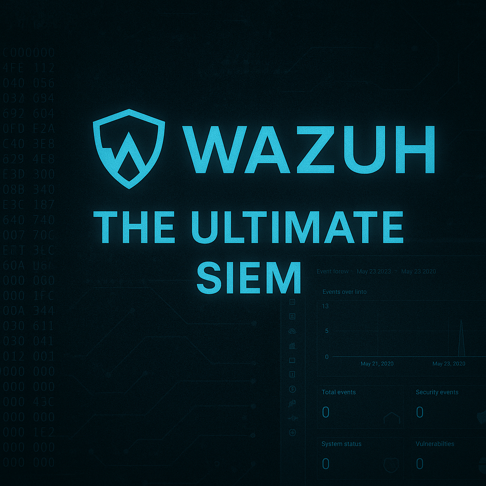
# **Índice**

[Capítulo 1](#section-1)

[1.1 Introdução](#introdução)

[Capítulo 2](#section-2)

[2.1 Instalação do Wazuh-Manager](#instalação-do-wazuh-manager)

[Capítulo 3](#section-3)

[3.1 Instalação dos Wazuh-Agents](#instalação-dos-wazuh-agents)

[3.2 Instalação do Wazuh-Agent no Debian13](#instalação-do-wazuh-agent-no-debian13)

[3.3 Instalação do Wazuh-Agent no Rocky10](#instalação-do-wazuh-agent-no-rocky10)

[3.4 Instalação do Wazuh-Agent no Windows11](#instalação-do-wazuh-agent-no-windows11)

[Capítulo 4](#section-4)

[4.1 File Integrity Monitoring (FIM)](#file-integrity-monitoring-fim)

[4.2 Configuração do FIM no Rocky10 (agent-ams)](#configuração-do-fim-no-rocky10-agent-ams)

[4.3 Configuração do FIM no Debian13 (agent-asilva)](#configuração-do-fim-no-debian13-agent-asilva)

[4.4 Configuração do FIM no Windows11 (agent-winzuh)](#configuração-do-fim-no-windows11-agent-winzuh)

[Capítulo 5](#section-5)

[5.1 Threat Hunting com Active Response](#threat-hunting-com-active-response)

[5.1.1 Configuração no Rocky10 (agent-ams)](#configuração-no-rocky10-agent-ams)

[5.1.1.1 Configuração no Wazuh-Manager (Integração VirusTotal)](#configuração-no-wazuh-manager-integração-virustotal)

[5.1.1.2 Configuração da Resposta Ativa (Wazuh-Manager)](#configuração-da-resposta-ativa-wazuh-manager)

[ Definir o Comando](#definir-o-comando)

[ Definir a Resposta Ativa](#definir-a-resposta-ativa)

[ Definir regra](#definir-regra)

[ Criar o script de remoção de ficheiro no Rocky10](#criar-o-script-de-remoção-de-ficheiro-no-rocky10)

[ Dar permissões de execução](#dar-permissões-de-execução)

[ Demonstração](#demonstração)

[5.1.2 Configuração no Debian13 (agent-asilva)](#configuração-no-debian13-agent-asilva)

[ Instalar jq](#instalar-jq)

[ Criar o script de remoção de ficheiro no Debian13](#criar-o-script-de-remoção-de-ficheiro-no-debian13)

[ Dar permissões de execução](#dar-permissões-de-execução-1)

[ Demonstração](#demonstração-1)

[5.1.3 Configuração no Windows11 (agent-winzuh)](#configuração-no-windows11-agent-winzuh)

[ Configuração do FIM](#configuração-do-fim)

[ Criação do Script de Remoção](#criação-do-script-de-remoção)

[ No Wazuh-Manager (Configuração do Comando Windows)](#no-wazuh-manager-configuração-do-comando-windows)

[ Configuração da Resposta Ativa para o Windows](#configuração-da-resposta-ativa-para-o-windows)

[ Demonstração](#demonstração-2)

[5.1.4 Conclusão: Threat Hunting com Active Response](#conclusão-threat-hunting-com-active-response)

[Capítulo 6](#section-6)

[6.1 Introdução: Prevenção de Intrusões e Resposta Ativa em Ambientes de Rede](#introdução-prevenção-de-intrusões-e-resposta-ativa-em-ambientes-de-rede)

[6.2 Instalação do Suricata nos Wazuh-Agents (Rocky10 e Debian13)](#instalação-do-suricata-nos-wazuh-agents-rocky10-e-debian13)

[6.2.1 Instalação do Suricata no Rocky10](#instalação-do-suricata-no-rocky10)

[6.2.2 Instalação do Suricata no Debian13](#instalação-do-suricata-no-debian13)

[6.3 Configuração e optimização do Suricata nos Agentes.](#configuração-e-optimização-do-suricata-nos-agentes.)

[6.3.1 Configuração do Suricata no Rocky10](#configuração-do-suricata-no-rocky10)

[ Instalar regras do suricata no Agent](#instalar-regras-do-suricata-no-agent)

[ Identificar o interface.](#identificar-o-interface.)

[ Editar o ficheiro de configuração do serviço.](#editar-o-ficheiro-de-configuração-do-serviço.)

[ Configurar o Wazuh-Agent (agent-ams)](#configurar-o-wazuh-agent-agent-ams)

[ Verificar as permissões](#verificar-as-permissões)

[6.3.2 Configuração do Suricata no Debian13](#configuração-do-suricata-no-debian13)

[ Instalar regras do suricata no Agent](#instalar-regras-do-suricata-no-agent-1)

[ Identificar o interface.](#identificar-o-interface.-1)

[ Editar o ficheiro de configuração do serviço.](#editar-o-ficheiro-de-configuração-do-serviço.-1)

[ Configurar o Wazuh-Agent (agent-asilva)](#configurar-o-wazuh-agent-agent-asilva)

[ Verificar as permissões](#verificar-as-permissões-1)

[6.4 Configuração e optimização do Suricata no Wazuh-Manager.](#configuração-e-optimização-do-suricata-no-wazuh-manager.)

[ Editar o Ficheiro do Manager](#editar-o-ficheiro-do-manager)

[ Padronização do Sistema de Firewall (Firewalld)](#padronização-do-sistema-de-firewall-firewalld)

[ Script firewalld](#script-firewalld)

[Script para o Rocky10.](#script-para-o-rocky10.)

[6.5 Demonstração](#demonstração-3)

[ Testes efetuados antes da aplicação do bloqueio.](#testes-efetuados-antes-da-aplicação-do-bloqueio.)

[ Bloqueio do endereço de IP do Parrot OS no Debian13 (agent-asilva):](#bloqueio-do-endereço-de-ip-do-parrot-os-no-debian13-agent-asilva)

[ Bloqueio do endereço de IP do Parrot OS no Rocky10 (agent-ams):](#bloqueio-do-endereço-de-ip-do-parrot-os-no-rocky10-agent-ams)

[6.6 Conclusão: Eficácia da Resposta Ativa e Mitigação de Reconhecimento de Rede](#conclusão-eficácia-da-resposta-ativa-e-mitigação-de-reconhecimento-de-rede)

[Capítulo 7](#section-7)

[7.1 Segurança Aplicacional (Web)](#segurança-aplicacional-web)

[7.1.1 Configuração do Apache no Rocky10 (agent-ams)](#configuração-do-apache-no-rocky10-agent-ams)

[7.1.2 Configuração do Apache no Debian13 (agent-asilva)](#configuração-do-apache-no-debian13-agent-asilva)

[7.1.3 Configurar o DNS no Parrot OS (Atacante)](#configurar-o-dns-no-parrot-os-atacante)

[7.1.4 Configurar a leitura de Logs (Nos Agentes)](#configurar-a-leitura-de-logs-nos-agentes)

[ No Debian (agent-asilva):](#no-debian-agent-asilva)

[ No Rocky (agent-ams):](#no-rocky-agent-ams)

[7.1.5 Criação de scripts](#criação-de-scripts)

[ Dar permissões de execução](#_Toc218108268)

[7.1.6 Configurar o Bloqueio de 30 e 40 minutos (No Manager)](#configurar-o-bloqueio-de-30-e-40-minutos-no-manager)

[7.1.7 Realizar o Ataque DoS](#realizar-o-ataque-dos)

[ Ataque ao Rocky10 (agent-ams) – Evidências:](#ataque-ao-rocky10-agent-ams-evidências)

[ Ataque ao Debian13 (agent-asilva) - Evidências:](#ataque-ao-debian13-agent-asilva---evidências)

[ Bloqueio após ataque ao Rocky10 (agent-ams) - Evidências:](#bloqueio-após-ataque-ao-rocky10-agent-ams---evidências)

[ Bloqueio após ataque ao Debian13 (agent-asilva):](#bloqueio-após-ataque-ao-debian13-agent-asilva)

[7.2 Conclusão: Ataques DoS e sua mitigação.](#conclusão-ataques-dos-e-sua-mitigação.)

[Capítulo 8](#section-8)

[8.1 Proteção de Camada Aplicacional: Deteção de Intrusão com OWASP ZAP e Resposta Ativa](#proteção-de-camada-aplicacional-deteção-de-intrusão-com-owasp-zap-e-resposta-ativa)

[8.1.1 Configuração do Wazuh-Manager](#configuração-do-wazuh-manager)

[8.1.2 Execução do Ataque no Parrot (OWASP ZAP)](#execução-do-ataque-no-parrot-owasp-zap)

[ Active scan ao Debian13 - Evidências](#active-scan-ao-debian13---evidências)

[ Active scan ao Rocky10 - Evidências](#active-scan-ao-rocky10---evidências)

[Capítulo 9](#section-9)

[9.1 Gestão Centralizada de Agentes: Grupos Windows e Linux](#gestão-centralizada-de-agentes-grupos-windows-e-linux)

[9.1.1 Criar os Grupos no Wazuh-Dashboard](#criar-os-grupos-no-wazuh-dashboard)

[9.1.2 Atribuir os Agentes aos Grupos](#atribuir-os-agentes-aos-grupos)

[9.1.3 Personalização](#personalização)

[Capítulo 10](#section-10)

[10.1 Conclusão final](#conclusão-final)

[Glossário](#glossário)

[i Audit](#audit)

[ii Hash](#hash)

[iii Threat hunting](#threat-hunting)

[iv Active response](#active-response)

[v chmod](#chmod)

[vi chown](#chown)

[vii Pasta tmp](#pasta-tmp)

[viii curl -LO](#curl--lo)

[ix Regras do Suricata](#regras-do-suricata)

[x Análise da Configuração de Variáveis de Rede no Suricata](#análise-da-configuração-de-variáveis-de-rede-no-suricata)

[xi DoS (Denial of Service)](#dos-denial-of-service)

[xii Wazuh – Regras](#wazuh-regras)

[xiii hping3](#hping3)

[xiv OWASP ZAP](#owasp-zap)

[Webography](#webography)

# 

# 

## Introdução

O presente relatório documenta a implementação de um ambiente de cibersegurança robusto, focado na utilização da plataforma open-source **Wazuh** como solução centralizada de **IDS (Intrusion Detection System)** e **IPS (Intrusion Prevention System)**. O objetivo principal é simular um cenário empresarial realista, onde diferentes sistemas operativos (Linux Mint, Debian13, Rocky10 e Windows11) são monitorizados e protegidos contra diversas ameaças.

**Os objetivos específicos a alcançar**, delineados pelo enunciado, incluem:

- **Implementação e Configuração:** Instalação e gestão de agentes Wazuh numa infraestrutura mista.

- **Monitorização de Integridade (FIM):** Configuração de alertas em tempo real para adição/alteração/eliminação de ficheiros em diretórios críticos.

- **Gestão de Ameaças (Threat Hunting):** Deteção e resposta ativa (eliminação de ficheiros) a vírus simulados (EICAR) através de integração com VirusTotal.

- **Prevenção de Intrusão (IPS):** Implementação de mecanismos de bloqueio automático de IPs atacantes, com tempos de retenção específicos para ataques de *Port Scan* (Nmap), *Denial of Service* (hping3) e *Vulnerability Scanning* (OWASP ZAP).

- **Gestão e Escalabilidade:** Organização dos agentes em grupos lógicos (Linux e Windows) para gestão centralizada de políticas.

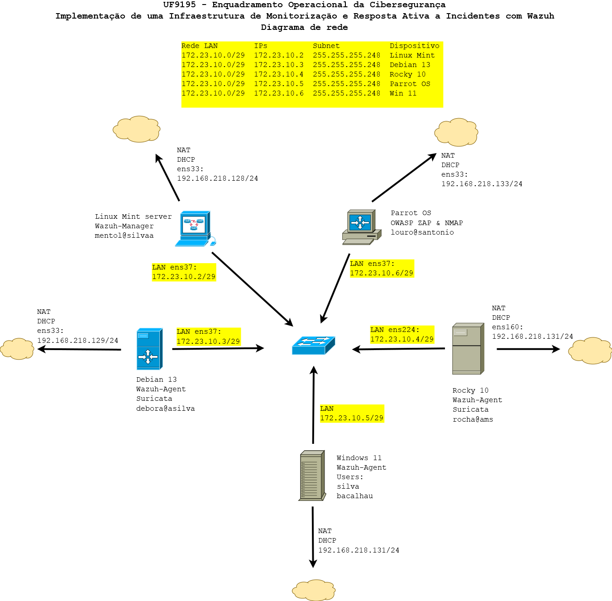

Figura 1. Diagrama de rede

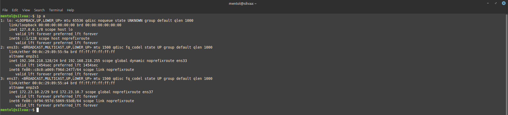

Figura 2. Linux Mint - Configuração de rede

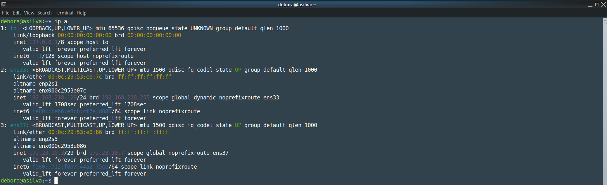

Figura 3. Debian 13 - Configuração de rede

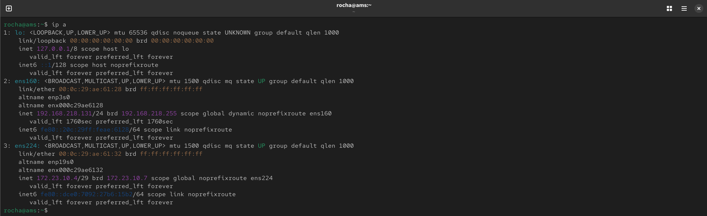

Figura 4. Rocky 10 - Configuração de rede

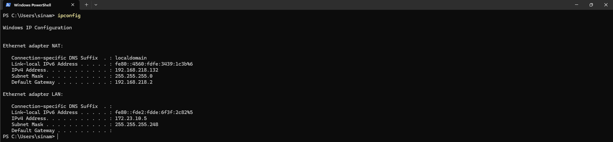

Figura 5. Windows 11 - Configuração de rede

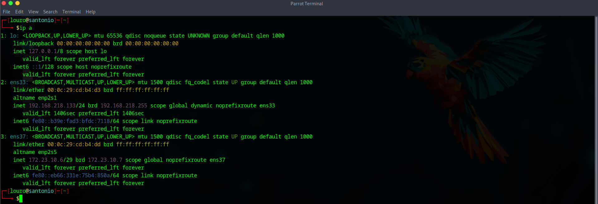

Figura 6. Parrot OS - Configuração de rede

# 

## Instalação do Wazuh-Manager 

Podemos aceder, à documentação relativa à instalação, através do seguinte link: <https://documentation.wazuh.com/current/quickstart.html>

Iniciamos este projecto com a instalação do Wazuh-Manager no Linux Mint. Aqui será feita a monitorização de toda a rede.

Usamos o seguinte comando:

mentol@silvaa:~\$ curl -sO https://packages.wazuh.com/4.14/wazuh-install.sh && sudo bash ./wazuh-install.sh -a

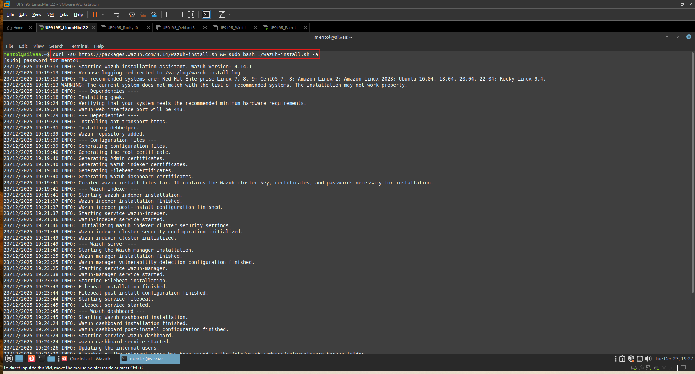

Figura 7. Instalação do Wazuh-Manager no Linux Mint

No fim da instalação, é-nos atribuído um user e uma password que devemos guardar.

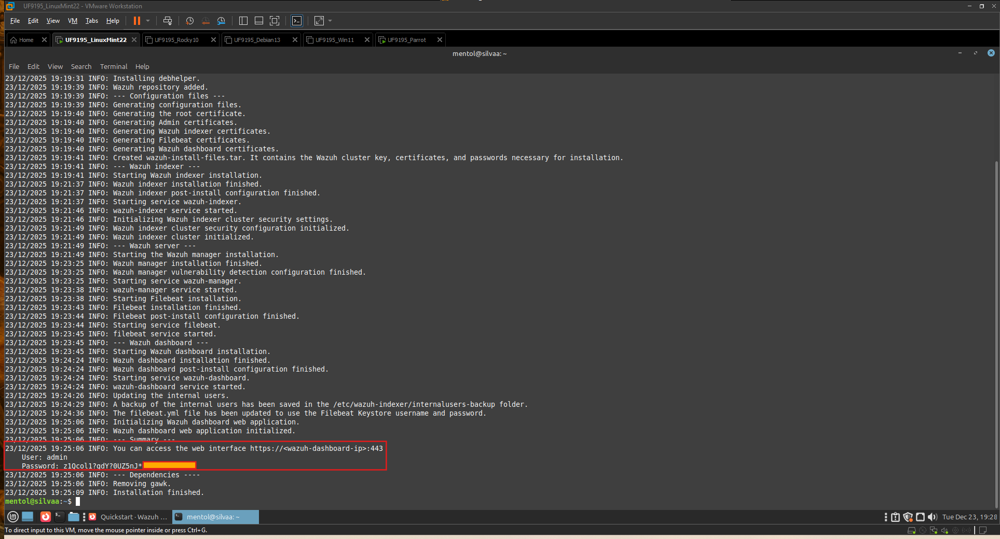

Figura 8. Instalação do Wazuh-Manager no Linux Mint – User e Password

Caso seja necessário, podemos visualizar todas as passwords através do comando:

mentol@silvaa:~\$ sudo tar -O -xvf wazuh-install-files.tar wazuh-install-files/wazuh-passwords.txt

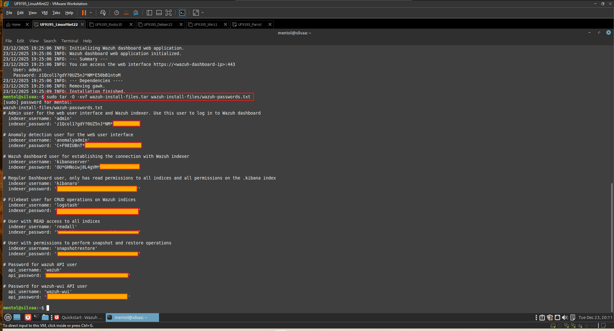

Figura 9. Instalação do Wazuh-Manager no Linux Mint – Visualização das Passwords

Acedemos ao dashboard do Wazuh através da morada https://\<wazuh-dashboard-ip\>:443, como indicado após a instalação.

No meu caso usei a morada: https://172.23.10.2:443

Introduzimos as credenciais que foram providenciadas após a instalação.

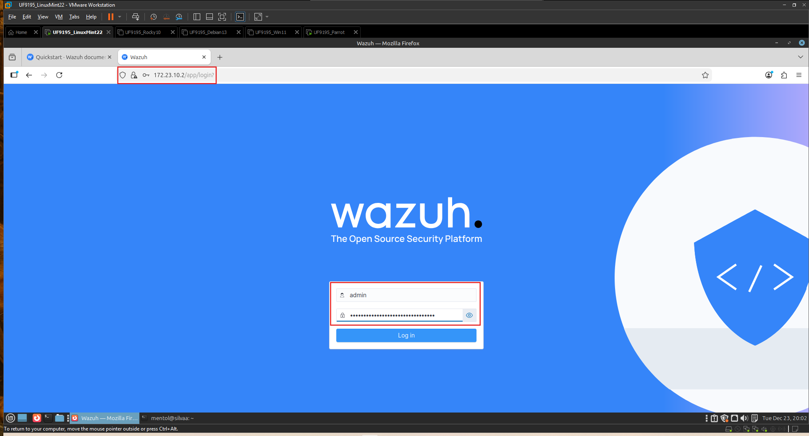

Figura 10. Linux Mint - Menú de Login do Wazuh-Manager

Após o login, somos direccionados para o dashboard do Wazuh, como podemos verificar na figura seguinte.

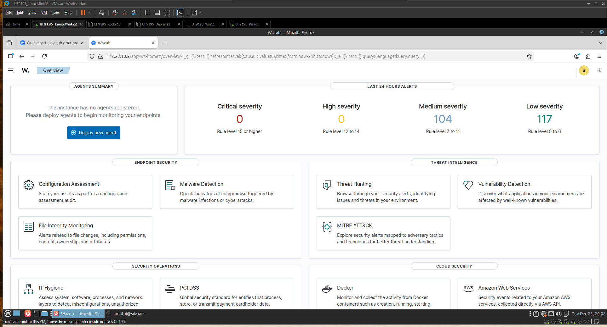

Figura 11. Linux Mint – Dashboard do Wazuh-Manager

Uma ação recomendada pela equipa do Wazuh, é a de desabilitar os “*Wazuh package repositories*” após a instalação, de forma a prevenir upgrades acidentais. Executamos o seguinte comando:

mentol@silvaa:~\$ sudo sed -i "s/^deb /#deb /" /etc/apt/sources.list.d/wazuh.list

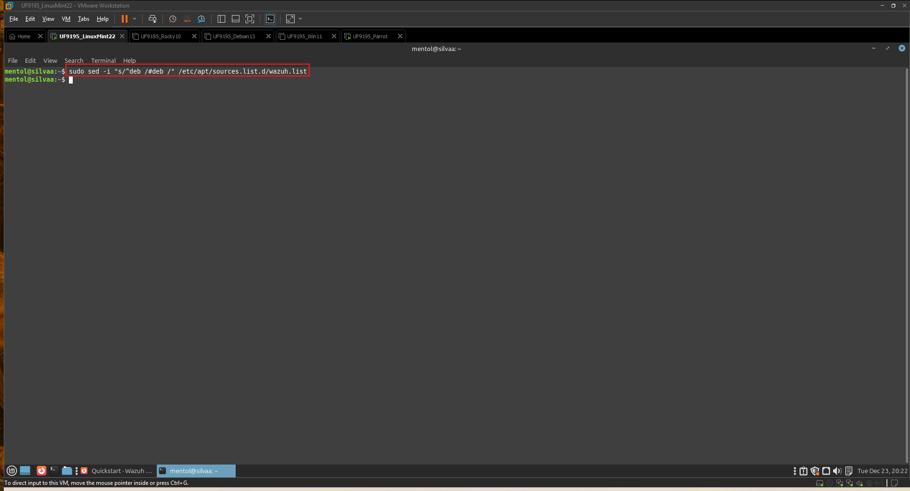

Figura 12. Linux Mint – Comando para desabilitar os “Wazuh package repositories” após a instalação.

# 

## Instalação dos Wazuh-Agents

Na documentação providenciada na página do Wazuh, encontramos o seguinte diagrama que ensina a arquitectura e módulos dos agentes. Na realização deste projecto, iremos explorar algumas destas funcionalidades.

De acordo com a equipa do Wazuh: “*O agente Wazuh é uma multi-plataforma e funciona nos terminais que deseja monitorizar. Comunica com o servidor Wazuh, enviando dados em tempo quase real através de um canal encriptado e autenticado. O agente Wazuh foi desenvolvido considerando a necessidade de monitorizar uma grande variedade de terminais diferentes sem afetar o seu desempenho. É suportado nos sistemas operativos mais populares e necessita, em média, de 35 MB de RAM*.”

<https://documentation.wazuh.com/current/installation-guide/wazuh-agent/index.html>

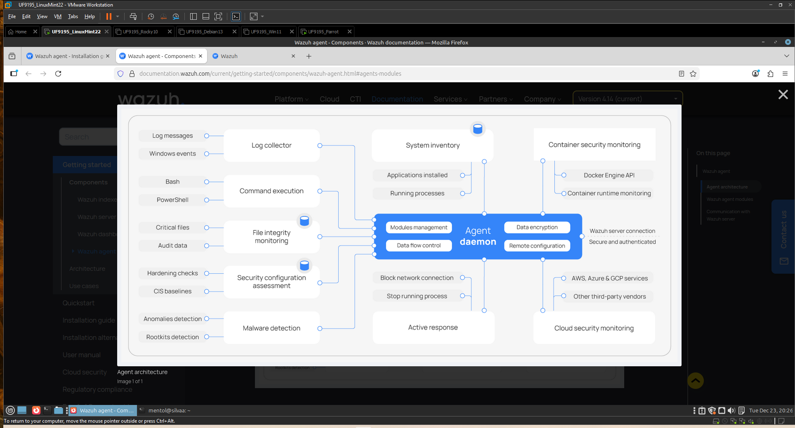

Figura 13. Wazuh - Diagrama da arquitetura e dos módulos dos agentes.

## Instalação do Wazuh-Agent no Debian13

No dashboard do Wazuh-Manager selecionamos “*Deploy new agent*”.

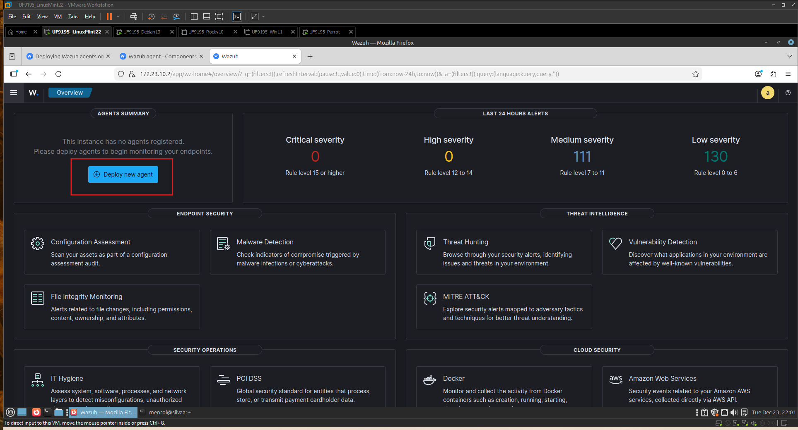

Figura 14. Wazuh-Manager Dashboard: Instalação de novo agente (início)

Na janela seguinte, escolhemos o sistema operativo e introduzimos o endereço IP do Wazuh-Manager, com o qual o Wazuh-Agent do Debian13 irá comunicar.

**manager_address**  
*“Nome do host ou endereço IP do gestor onde o agente será registado. Se não for definido nenhum valor, o agente tentará registar-se no mesmo gestor que foi especificado para a conexão.”*

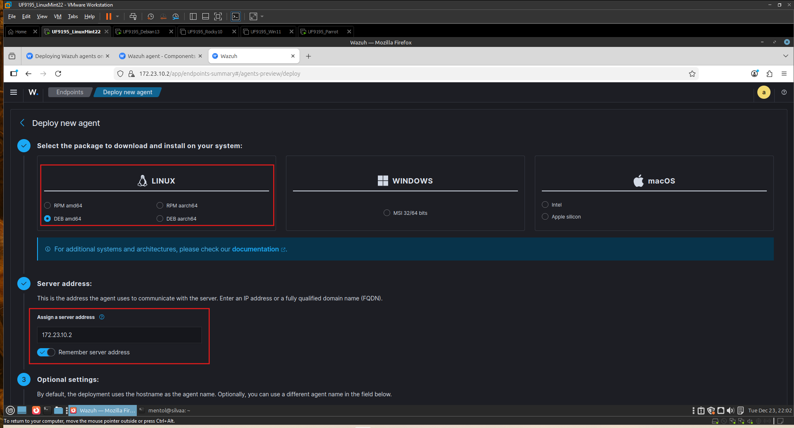

Figura 15. Wazuh-Manager Dashboard: Instalação de novo agente (atributos)

Atribuímos um nome único que identifique o Wazuh-Agent.

Para proceder com a instalação no Debian13, devemos copiar o comando que aparece no campo 4, como podemos verificar na figura seguinte.

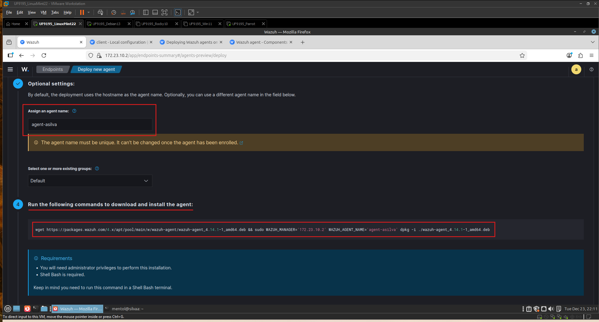

Figura 16. Wazuh-Manager Dashboard: Instalação de novo agente (atributos)

No Debian13, executamos o comando copiado do dashboard do Wazuh-Manager.

debora@asilva:~\$ wget https://packages.wazuh.com/4.x/apt/pool/main/w/wazuh-agent/wazuh-agent_4.14.1-1_amd64.deb && sudo WAZUH_MANAGER='172.23.10.2' WAZUH_AGENT_NAME='agent-asilva' dpkg -i ./wazuh-agent_4.14.1-1_amd64.deb

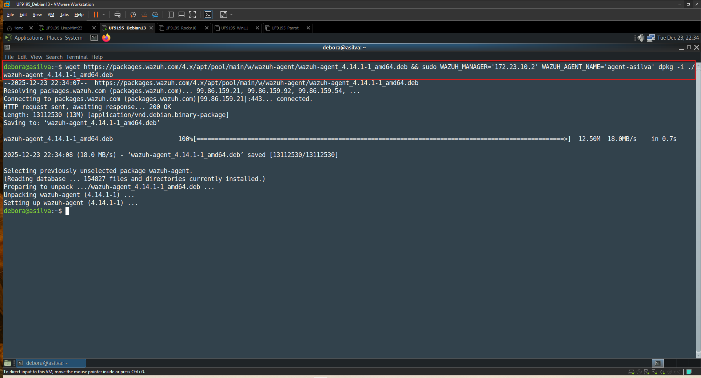

Figura 16. Debian13: Instalação do Wazuh-agent

Para que o Wazuh-Agent inicie automaticamente com o sistema, devemos executar os comandos ensinados na figura seguinte.

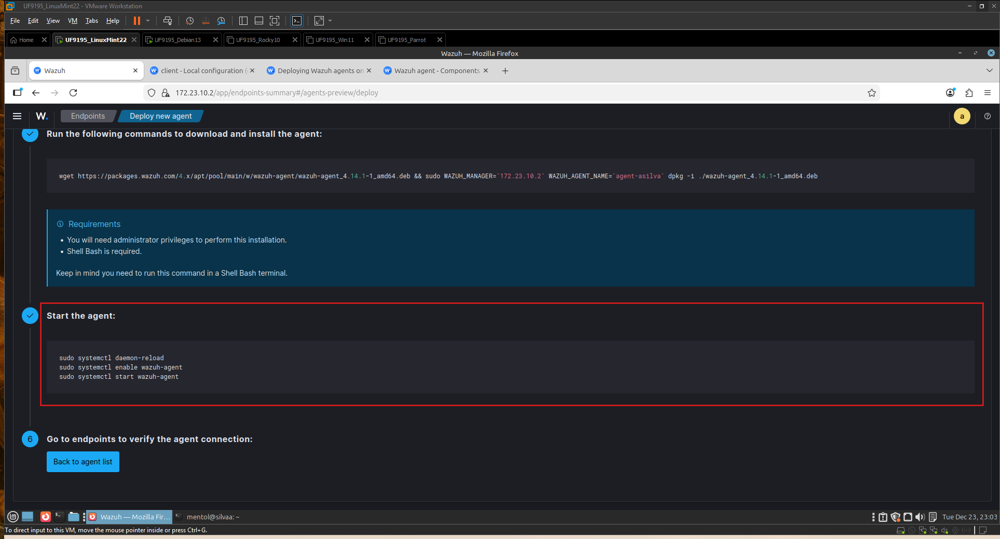

Figura 16. Wazuh-Manager Dashboard: Instalação do Wazuh-agent (finalização)

Comandos a executar:

debora@asilva:~\$ sudo systemctl daemon-reload

debora@asilva:~\$ sudo systemctl enable wazuh-agent

debora@asilva:~\$ sudo systemctl start wazuh-agent

Para verificar que o serviço se encontra ativo, executamos o comando seguinte:

debora@asilva:~\$ sudo systemctl status wazuh-agent

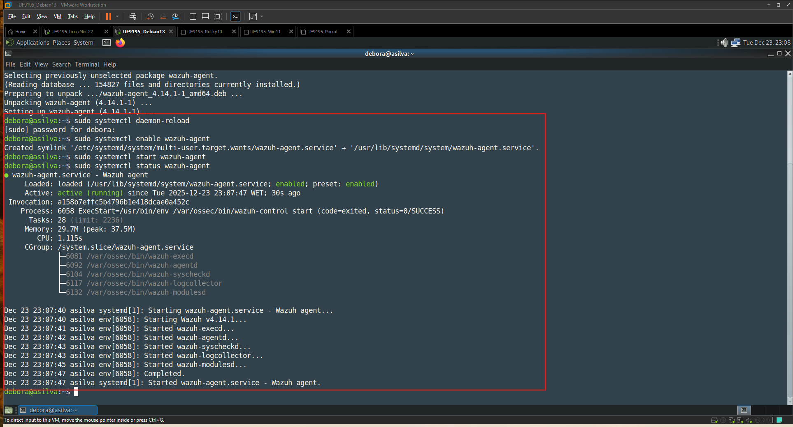

Figura 17. Debian13: Monitorização do estado do agente Wazuh

No Wazuh-Manager, verificamos que o agent-asilva já se encontra ativo. De forma a efetuar essa verificação, acedemos ao menú *Endpoints* através da *Barra lateral Agents management Summary*.

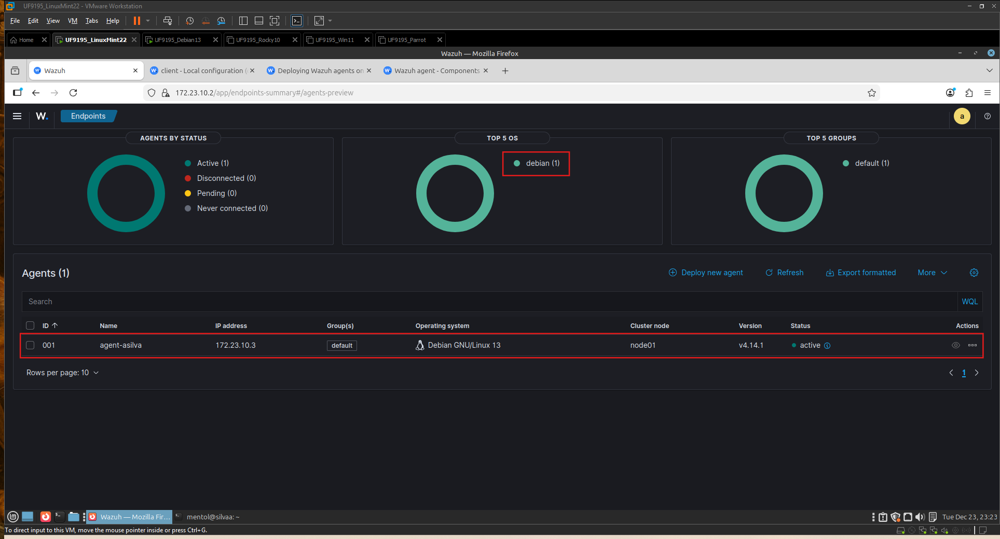

Figura 18. Wazuh-Manager: Monitorização do estado do agente Wazuh

## Instalação do Wazuh-Agent no Rocky10

No menú Endpoints, selecionamos *Deploy new agent*.

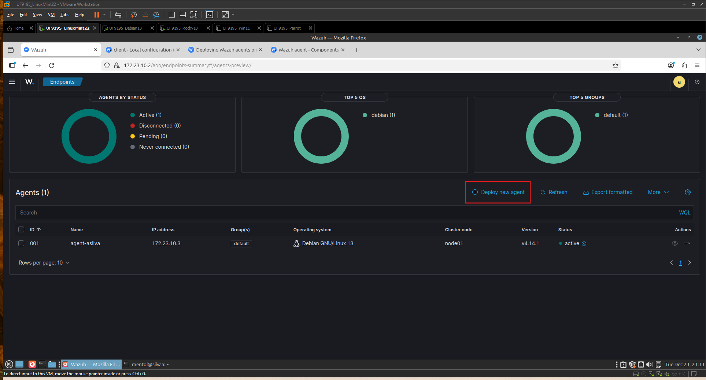

Figura 19. Wazuh-Manager Dashboard: Instalação de novo agente (início)

Selecionamos o repositório apropriado para o Rocky Linux e inserimos o endereço de IP do Wazuh-Manager (neste caso já se encontrava disponível, visto que tinha colocado o pisco para memorizá-lo quando criei o agente para o Debian13).

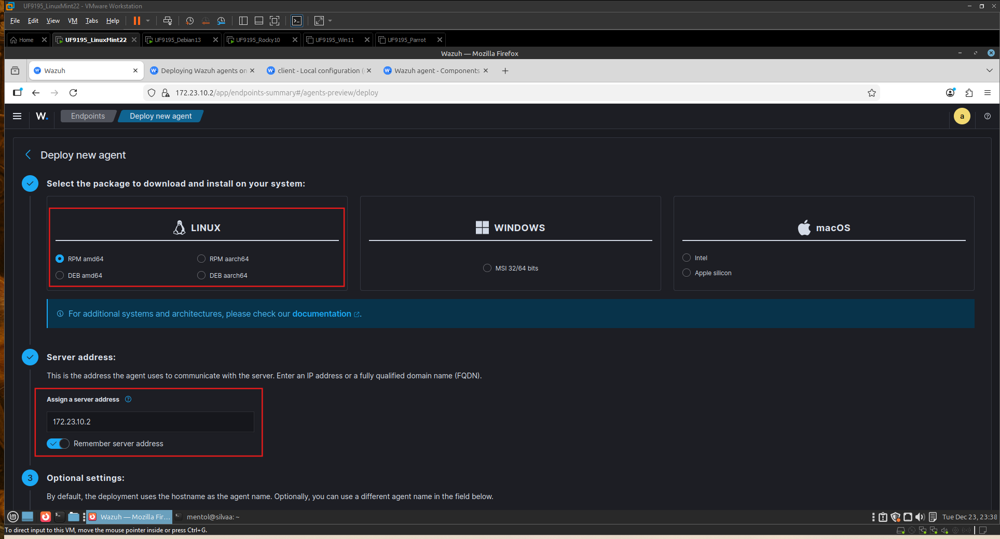

Figura 20. Wazuh-Manager Dashboard: Instalação de novo agente (atributos)

Atribuímos um nome ao agente que iremos instalar no Rocky10 e copiamos o comando que permitirá efetuar o download e posterior instalação do Wazuh-Agent.

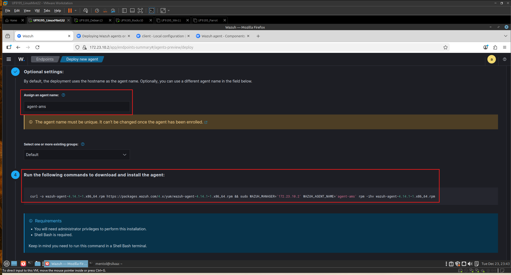

Figura 21. Wazuh-Manager Dashboard: Instalação de novo agente (atributos)

Executamos o comando no Rocky10.

rocha@ams:~\$ curl -o wazuh-agent-4.14.1-1.x86_64.rpm https://packages.wazuh.com/4.x/yum/wazuh-agent-4.14.1-1.x86_64.rpm && sudo WAZUH_MANAGER='172.23.10.2' WAZUH_AGENT_NAME='agent-ams' rpm -ihv wazuh-agent-4.14.1-1.x86_64.rpm

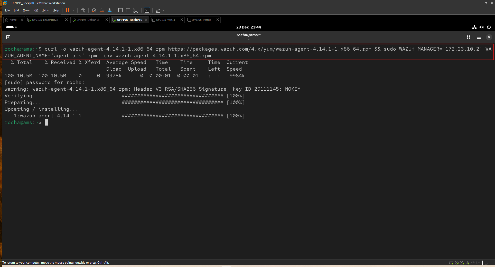

Figura 22. Rocky10: Instalação do Wazuh-agent

Para que o Wazuh-Agent inicie automaticamente com o sistema, devemos executar os seguintes comandos:

rocha@ams:~\$ sudo systemctl daemon-reload

rocha@ams:~\$ sudo systemctl enable wazuh-agent

rocha@ams:~\$ sudo systemctl start wazuh-agent

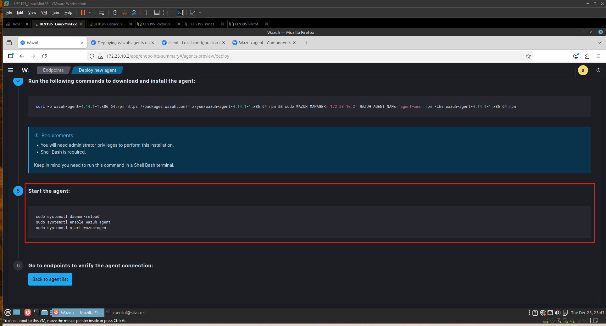

Figura 22. Wazuh-Manager Dashboard: Instalação de novo agente (finalização)

Para verificar que o serviço se encontra ativo, executamos o comando seguinte:

rocha@ams:~\$ sudo systemctl status wazuh-agent

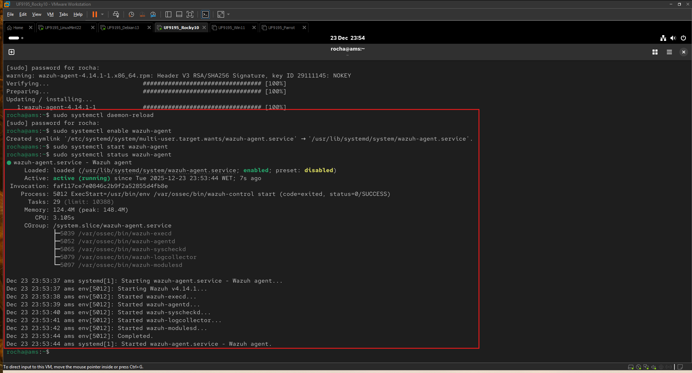

Figura 23. Rocky10: Monitorização do estado do agente Wazuh

No Wazuh-Manager, verificamos que o agent-ams já se encontra ativo. De forma a efetuar essa verificação, acedemos ao menú *Endpoints* através da *Barra lateral Agents management Summary*.

Falta-nos adicionar o Wazuh-Agent aos users do Windows11, algo que faremos de seguida.

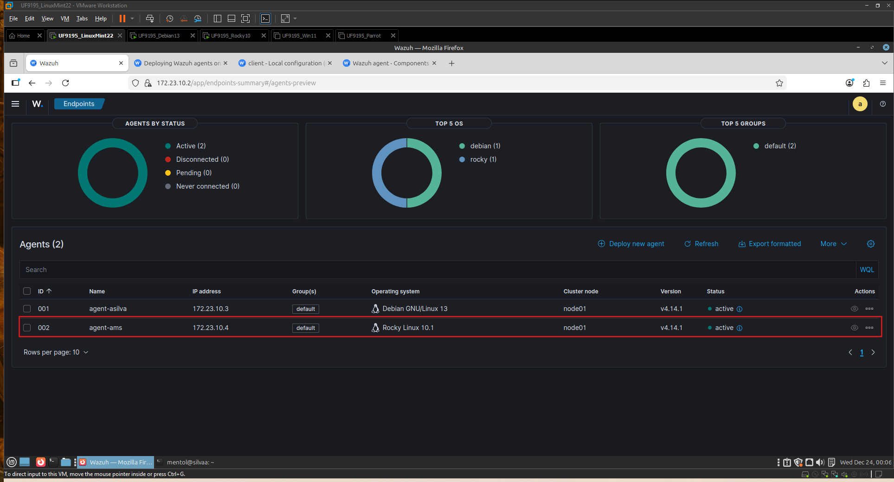

Figura 24. Wazuh-Manager Dashboard: Monitorização do estado do agente Wazuh

## Instalação do Wazuh-Agent no Windows11

O processo para instalação do Wazuh-Agent no Windows11 é semelhante. Começamos por selecionar *Deploy new agent*.

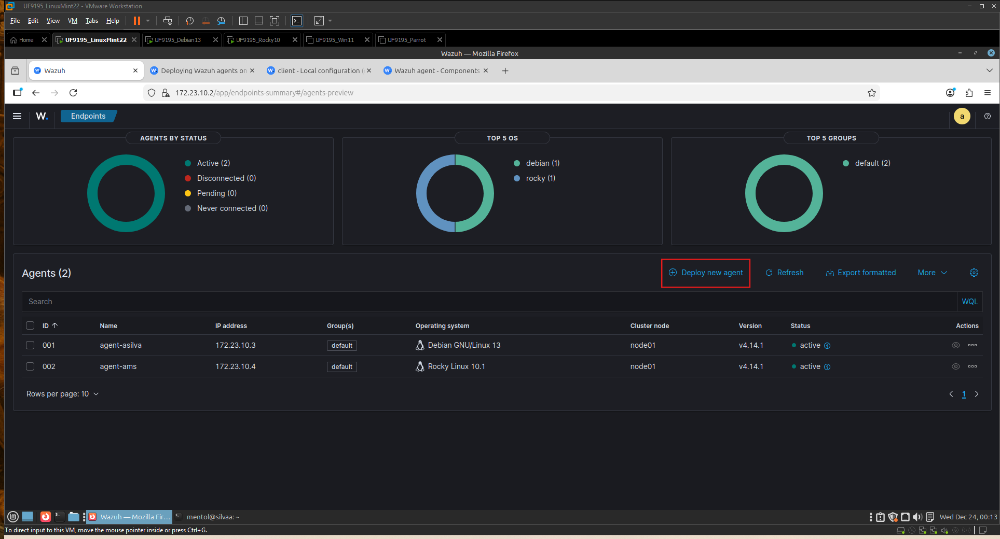

Figura 25. Wazuh-Manager Dashboard: Instalação de novo agente (início)

Selecionamos o sistema operativo Windows e mantemos o endereço de IP do Wazuh-Manager que tinhamos atribuído e memorizado anteriormente.

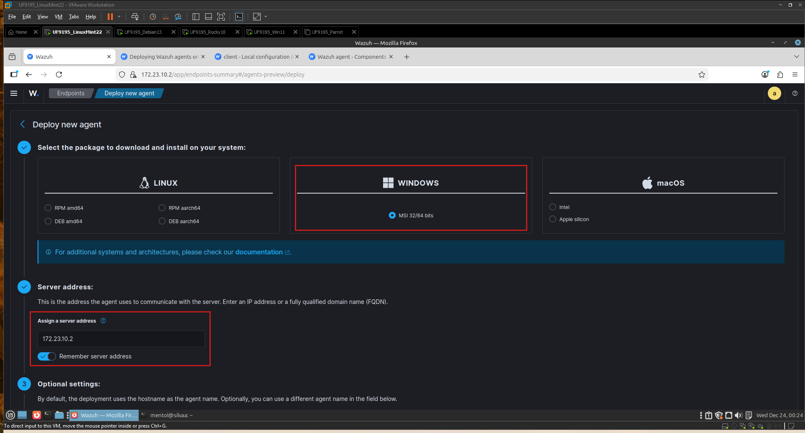

Figura 26. Wazuh-Manager Dashboard: Instalação de novo agente (atributos)

Como fizemos para os agentes anteriores, atribuímos um nome e copiamos o comando que deverá ser executado no Wazuh-Agent.

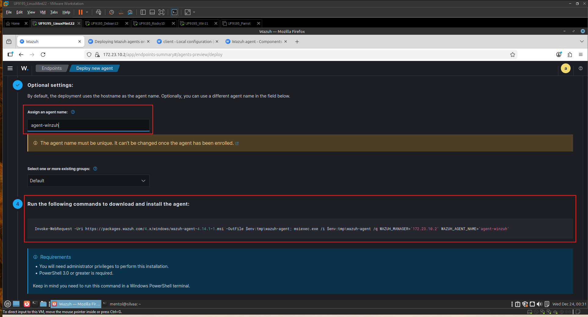

Figura 27. Wazuh-Manager Dashboard: Instalação de novo agente (atributos)

Comando a executar no Windows11, que permitirá o download e posterior instalação do Wazuh-Agent:

PS C:\WINDOWS\system32\> Invoke-WebRequest -Uri https://packages.wazuh.com/4.x/windows/wazuh-agent-4.14.1-1.msi -OutFile \$env:tmp\wazuh-agent; msiexec.exe /i \$env:tmp\wazuh-agent /q WAZUH_MANAGER='172.23.10.2' WAZUH_AGENT_NAME='agent-winzuh'

Após a instalação, executamos o comando seguinte, de forma a iniciar o serviço.

PS C:\WINDOWS\system32\> NET START Wazuh

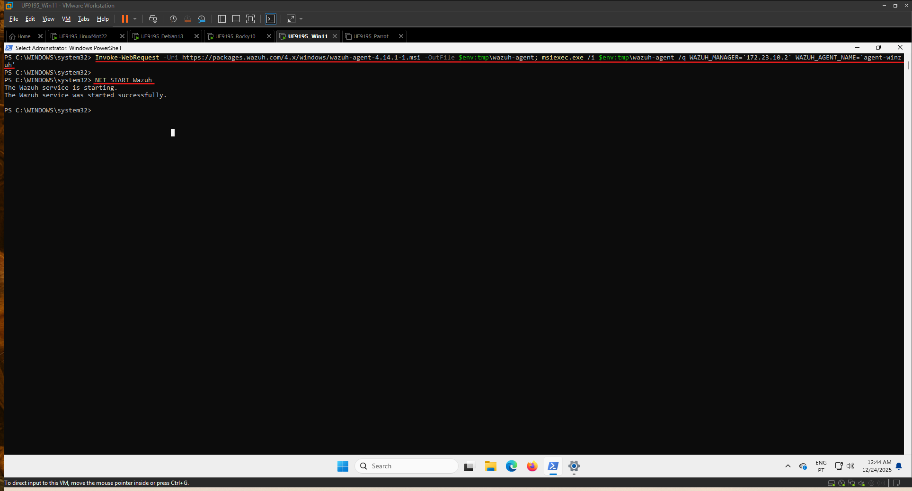

Figura 28. Windows11: Instalação do Wazuh-agent

Nos *Endpoints* do Wazuh-Manager, verificamos que o agent-winzuh foi adicionado com sucesso.

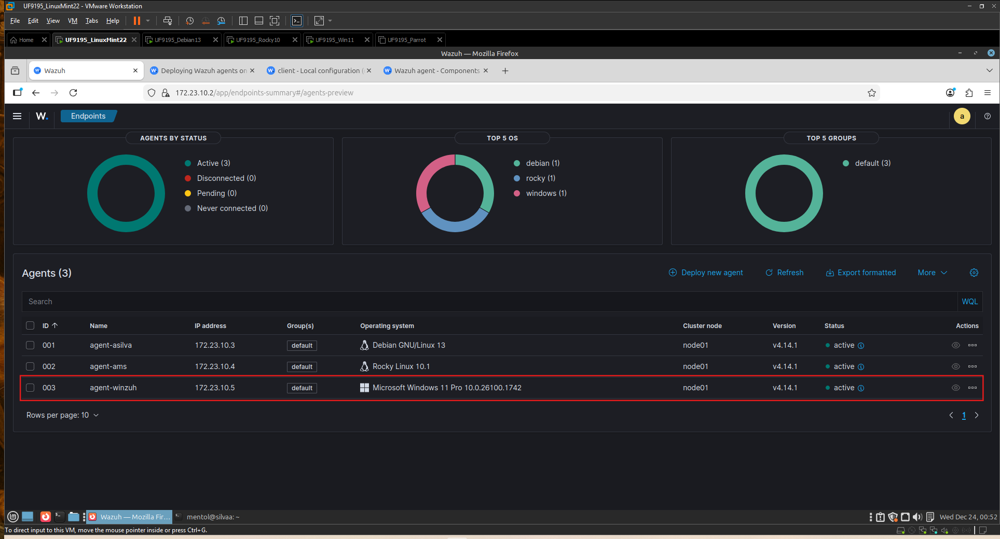

Figura 29. Wazuh-Manager Dashboard: Monitorização do estado do agente Wazuh

Finalizada a fase inicial, a instalação e comunicação entre o Manager e os agentes Wazuh encontram-se operacionais. O foco do próximo capítulo será a implementação do **File Integrity Monitoring (FIM)**, permitindo a monitorização detalhada da integridade de ficheiros em tempo real.

# 

## File Integrity Monitoring (FIM)

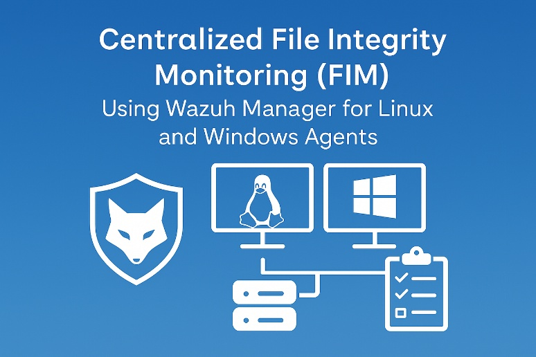

Figura 30. Wazuh FIM

<https://wazuh.com/resources/what-is/file-integrity-monitoring/?highlight=fim>

<https://wazuh.com/resources/use-cases/file-integrity-monitoring/?highlight=fim>

O **File Integrity Monitoring (FIM)** é um mecanismo de segurança que monitoriza o sistema de ficheiros, reportando quando os ficheiros são criados, eliminados ou modificados. Acompanha alterações nos atributos dos ficheiros, permissões, propriedade e conteúdo. Quando ocorre um evento, regista em tempo real quem alterou, o que foi alterado e quando.

Principais funções do FIM:

**1. Deteção de Alterações em Tempo Real**

O FIM monitoriza a criação, modificação ou eliminação de ficheiros. Se um atacante alterar um ficheiro de configuração (como o /etc/shadow no Linux ou o registo do Windows), o FIM deteta essa mudança instantaneamente.

**2. O "Quem, Quando e O Quê"**

O módulo FIM do Wazuh não só reporta que algo foi alterado, como fornece, igualmente, detalhes cruciais:

- **Quem:** Identifica o utilizador ou processo que realizou a alteração (através do suporte a *Auditd* no Linux ou *SACLs* no Windows).

- **O Quê:** Mostra a diferença exata entre o ficheiro antigo e o novo (diff).

- **Quando:** Regista a data e hora exata do evento.

**3. Verificação de Atributos**

Ele não olha apenas para o conteúdo. O FIM monitoriza metadados, tais como:

- Permissões de ficheiro (ex: se um ficheiro privado se tornou público).

- Proprietário do ficheiro (Owner/Group).

- Tamanho do ficheiro.

- **Hashes (MD5, SHA1, SHA256):** Garante que o ficheiro é exatamente o mesmo e não foi substituído por uma versão maliciosa.

**4. Por que é fundamental para a Segurança?**

- **Deteção de Rootkits/Malware:** Malwares costumam substituir binários do sistema (como o ls ou ps) por versões alteradas para se esconderem. O FIM deteta isto através da alteração do Hash.

- **Conformidade (Compliance):** Normas como **PCI DSS**, **GDPR** e **HIPAA** exigem obrigatoriamente a monitorização de integridade para proteger dados sensíveis.

- **Prevenção de Erros Humanos:** Deteta quando um administrador altera uma configuração por erro que possa comprometer a segurança.

**Como funciona no Wazuh (na prática):**

O agente Wazuh faz uma verificação inicial (baseline) e guarda os hashes dos ficheiros configurados. Periodicamente (ou em tempo real), ele compara o estado atual com essa base de dados. Se houver uma discrepância, ele envia um alerta para o **Wazuh Manager**.

## Configuração do FIM no Rocky10 (agent-ams)

Iniciamos a configuração do FIM no Rocky10. O fiheiro de configuração encontra-se na pasta seguinte:

root@ams:~# cd /var/ossec/etc/

As boas práticas recomendam que se faça uma cópia, que servirá de backup, do ficheiro de configuração, antes que qualquer alteração seja feita. Efetuamos uma cópia do ficheiro e procedemos com a configuração.

root@ams:/var/ossec/etc# cp -va ossec.conf ossec.conf.original

'ossec.conf' -\> 'ossec.conf.original'

root@ams:/var/ossec/etc# vim ossec.conf

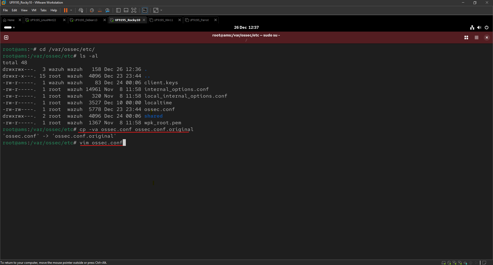

Figura 31. Backup do ficheiro de configuração do Wazuh (ossec.conf) no Rocky10 e comando de acesso ao editor

Introduzimos a seguinte alteração no ficheiro:

\<directories check_all="yes" report_changes="yes" realtime="yes"\>/home/ams\</directories\>

Após esta alteração, o Wazuh passa a reportar qualquer alteração efetuada no directório /home/rocha.

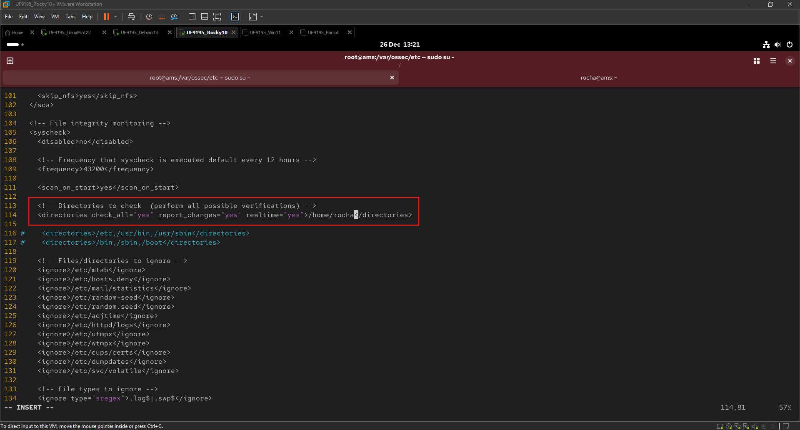

Figura 32. Edição do ficheiro de configuração do Wazuh-agent

Após introduzirmos esta alteração no ficheiro ossec.conf, instalamos o [audit](#audit) e respetivos plugins.

root@ams:/var/ossec/etc# sudo dnf install audit audispd-plugins

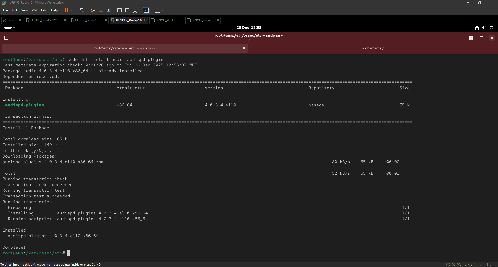

Figura 33. Instalação do audit no Rocky10

De seguida, executamos os seguintes comandos para que o audit inicie imediatamente e

fique habilitado a iniciar automaticamente com o sistema; verificamos as alterações.

root@ams:/var/ossec/etc# sudo systemctl enable auditd

root@ams:/var/ossec/etc# sudo systemctl start auditd

root@ams:/var/ossec/etc# sudo systemctl status auditd

Reiniciamos o Wazuh-Agent, para que as alterações entrem em efeito.

root@ams:/var/ossec/etc# sudo systemctl restart wazuh-agent

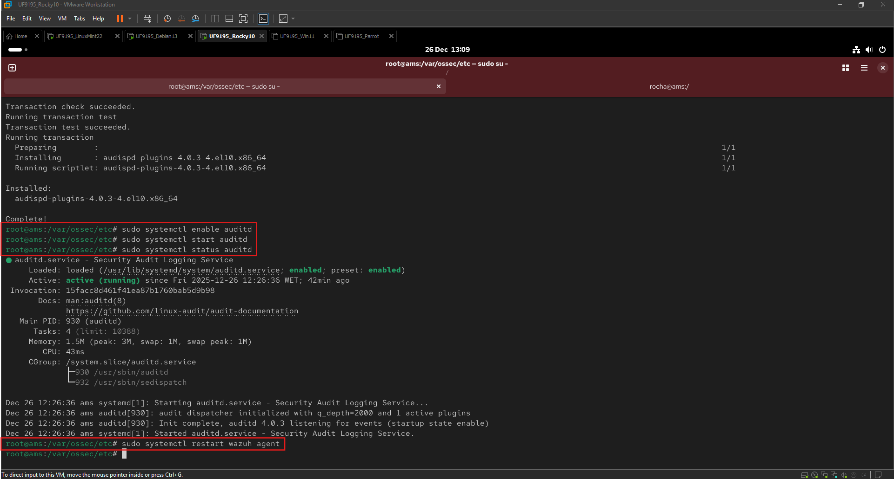

Figura 34. Monitorização do estado do audit no Rocky10

De forma a testar que alterações introduzidas surtiram efeito, criamos uma pasta e ficheiro no directório /home/rocha.

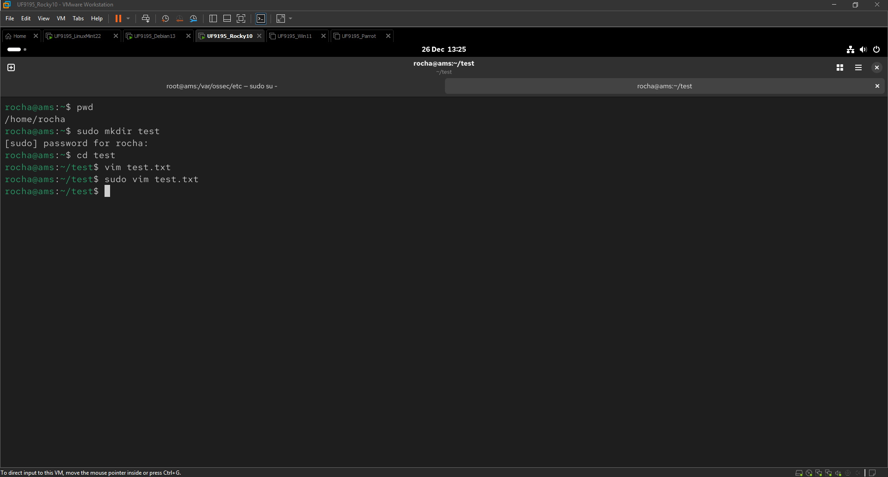

Figura 35. Rocky10: Validação da monitorização de integridade (FIM) via Auditd no Wazuh.

Neste momento, o Wazuh-Manager já está a receber a informação enviada pelo Wazuh-Agent do Rocky10, como podemos verificar na figura seguinte.

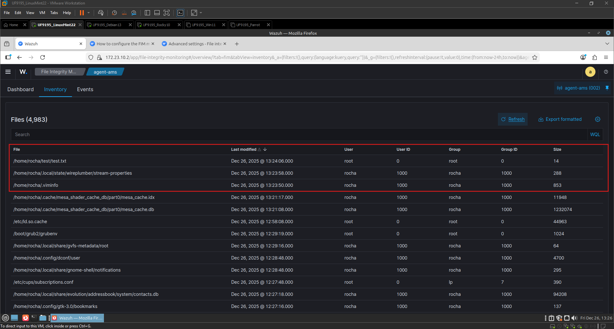

Figura 36. Wazuh-Manager: Validação da monitorização de integridade (FIM) via Auditd no Wazuh.

O Wazuh-Manager fornece logs detalhados que incluem o endereço IP e o nome do agente, a autoria da alteração (user), o carimbo temporal (timestamp) e o **[hash](#hash) do evento**, garantindo a integridade dos registos e outros metadados essenciais para análise forense e auditoria.

Nas figuras seguintes, apresento o exemplo de um log criado no Wazuh-Manager. Nele podemos encontrar informação detalhada do evento, importante para uma futura análise.

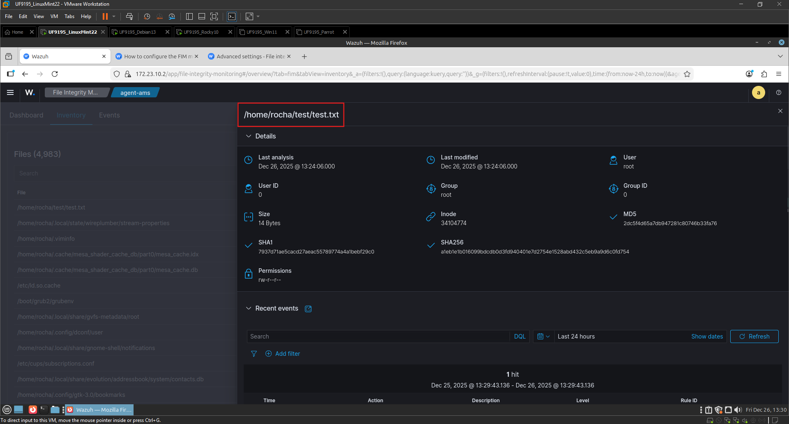

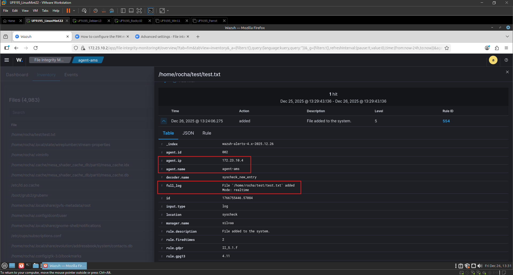

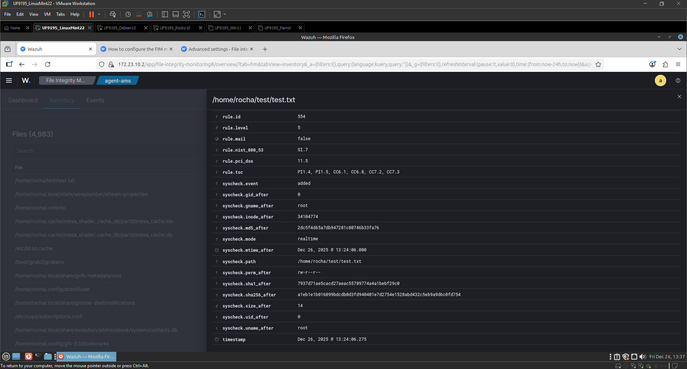

Figura 37. Wazuh-Manager: Registos (logs) de eventos de integridade de ficheiros (FIM).

## Configuração do FIM no Debian13 (agent-asilva)

Passamos à configuração do FIM no Debian13, que é em tudo semelhante à efetuada no Rocky10. O ficheiro de configuração encontra-se na pasta seguinte:

root@asilva:~# cd /var/ossec/etc/

As boas práticas recomendam que se faça uma cópia, que servirá de backup, do ficheiro de configuração, antes que qualquer alteração seja feita. Efetuamos uma cópia do ficheiro e procedemos com a configuração.

root@asilva:/var/ossec/etc# cp -va ossec.conf ossec.conf.original

'ossec.conf' -\> 'ossec.conf.original'

root@asilva:/var/ossec/etc# vim ossec.conf

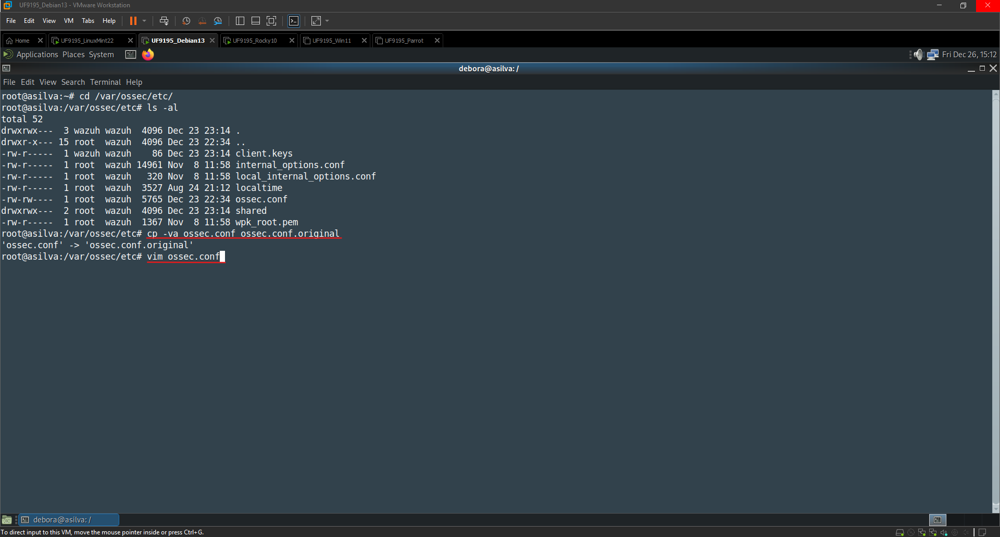

Figura 38. Debian13: Backup do ficheiro de configuração do Wazuh (ossec.conf) e comando de acesso ao editor

Introduzimos a seguinte alteração no ficheiro:

\<directories check_all="yes" report_changes="yes" realtime="yes"\>/home/debora/Downloads\</directories\>

Após esta alteração, o Wazuh passa a reportar qualquer alteração efetuada no directório /home/debora/Downloads.

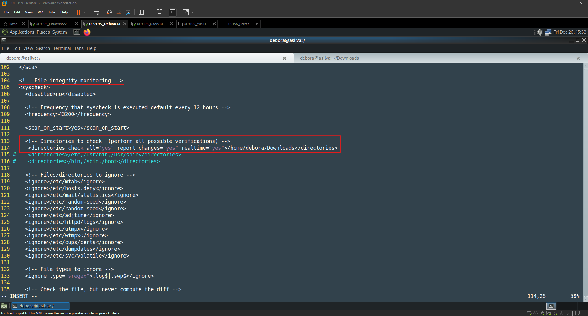

Figura 39. Debian13: Edição do ficheiro de configuração do Wazuh (ossec.conf)

Após introduzirmos esta alteração no ficheiro ossec.conf, instalamos o [audit](#audit) e respetivos plugins.

root@asilva:/var/ossec/etc# sudo apt install auditd audispd-plugins

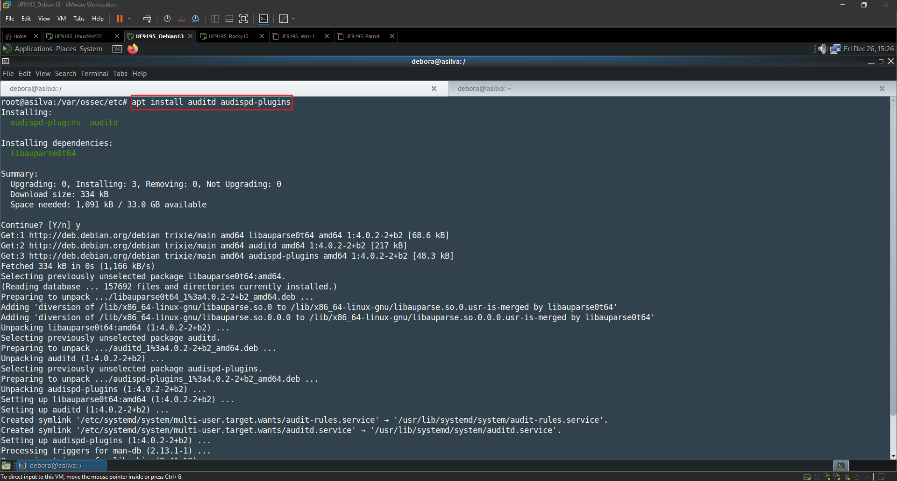

Figura 40. Debian13: Instalação do auditd

De seguida, executamos os seguintes comandos para que o audit inicie imediatamente e

fique habilitado a iniciar automaticamente com o sistema; verificamos as alterações.

root@asilva:/var/ossec/etc# sudo systemctl enable auditd

root@asilva:/var/ossec/etc# sudo systemctl start auditd

root@asilva:/var/ossec/etc# sudo systemctl status auditd

Reiniciamos o Wazuh-Agent, para que as alterações entrem em efeito.

root@asilva:/var/ossec/etc# sudo systemctl restart wazuh-agent

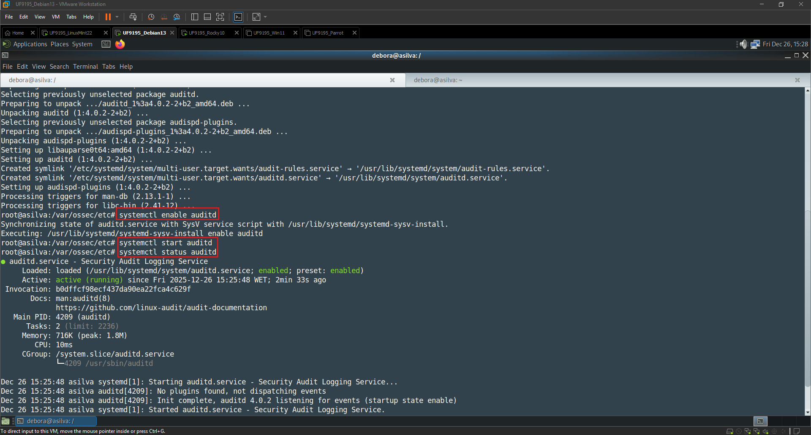

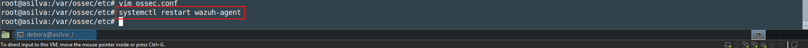

Figura 41. Debian 13: Verificação do serviço Auditd e reinício do agente Wazuh.

De forma a testar que as alterações introduzidas surtiram efeito, efetuamos o download do Google Chrome para o directório /home/debora/Downloads.

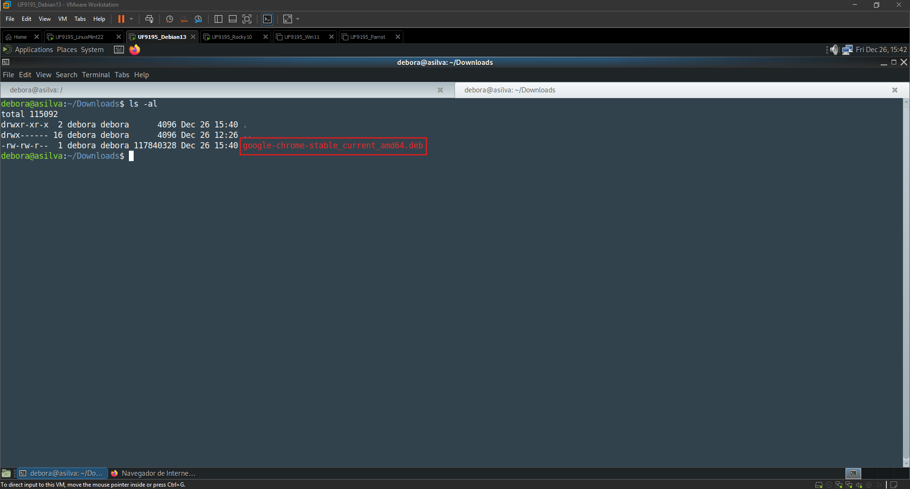

Figura 42. Debian13: Download de ficheiro de teste para a pasta /home/debora/Downloads

Neste momento, o Wazuh-Manager já está a receber a informação enviada pelo Wazuh-Agent do Debian13, como podemos verificar na figura seguinte.

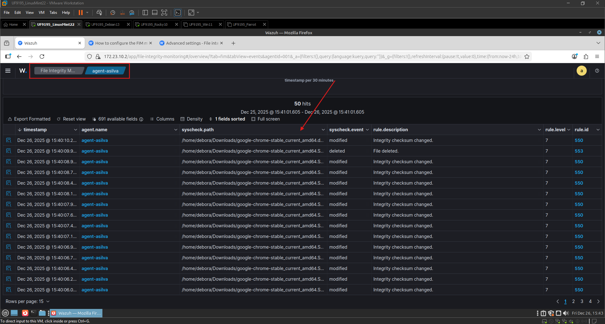

Figura 43. Wazuh-Manager: Visualização de alertas de monitorização de integridade

Como referi anteriormente, o Wazuh-Manager fornece logs detalhados que incluem o endereço IP e o nome do agente, a autoria da alteração (user), o carimbo temporal (timestamp) e o **[hash](#hash) do evento**, garantindo a integridade dos registos e outros metadados essenciais para análise forense e auditoria.

Nas figuras seguintes, apresento o exemplo de um log criado no Wazuh-Manager. Nele podemos encontrar informação detalhada do evento, importante para uma futura análise.


Figura 44. Wazuh-Manager: Registos (logs) de eventos de integridade de ficheiros (FIM)


Figura 45. Wazuh-Manager: Registos (logs) de eventos de integridade de ficheiros (FIM)

## Configuração do FIM no Windows11 (agent-winzuh)

Finalizamos a configuração do FIM nos agentes. O ficheiro de configuração encontra-se na pasta seguinte:

C:\Program Files (x86)\ossec-agent


Figura 46. Windows 11: Visualização da pasta de configuração do agente Wazuh

Como anteriormente, seguimos as boas práticas que recomendam que se faça uma cópia, que servirá de backup, do ficheiro de configuração, antes que qualquer alteração seja feita. Efetuamos uma cópia do ficheiro e procedemos com a configuração.


Figura 47. Windows 11: Cópia de seguarança do ficheiro de configuração do agente Wazuh (ossec.conf)

Acedemos ao ficheiro ossec.conf através do Powershell. Devemos fazê-lo com privilégios de administrador.


Figura 48. Windows 11: Edição do ficheiro de configuração do agente Wazuh (ossec.conf)

Adicionamos a seguinte linha:

\<directories\>C:\Users\\\Documents\</directories\>


Figura 49. Windows 11: Edição do ficheiro de configuração do agente Wazuh (ossec.conf)

**Explicação da configuração:**

- **C:\Users\\\Documents**: O uso do asterisco (\*) funciona como uma *wildcard*. Isto indica ao Wazuh que deve monitorizar a pasta "Documents" dentro de **cada perfil de utilizador** existente no sistema.

- **whodata="yes"**: Como mencionado anteriormente, esta opção é crucial. É ela que permite ao Wazuh dizer-lhe exatamente qual o utilizador (ex: bacalhau) que criou, alterou ou apagou o ficheiro.

Um detalhe importante é o referente ao campo recursion_level="0".

Esta parte da configuração indica ao Wazuh quantas folders e subfolders queremos que o agente inspecione. Caso queiramos inspecionar todas as folders e subfolders, removemos essa parte.

| **Valor** | **O que vigia**                |
|-----------|--------------------------------|
| 0         | **Só a pasta raiz** (ex: /etc) |
| 1         | Pasta + 1 nível (ex: /etc/ssh) |
| 5         | Pasta + até 5 níveis profundos |
| 256       | **Padrão** (quase ilimitado)   |

Gravamos o ficheiro e fechamos.

Acedemos ao Gestor de Serviços (services.msc) e reiniciamos o serviço para que as alterações efetuadas entrem em efeito. Através do Powershell seria Restart-Service -Name wazuh.


Figura 50. Windows 11: Reiniciar agente Wazuh

Verificamos se as configurações entraram em efeito. Para tal, criei um ficheiro de texto na pasta C:\Documents dos dois users: bacalhau e silva.


Figura 51. Windows 11: Ficheiro de teste criado na pasta Documents do user silva

No Wazuh-Manager, verificamos que o serviço se encontra ativo e a funcionar. O **whodata** permite que haja uma distinção entre os users, o que facilita a posterior análise dos logs.


Figura 52. Wazuh-Manager: Monitorização de eventos do utilizador 'bacalhau' (Windows 11)


Figura 53. Wazuh-Manager: Monitorização de eventos do utilizador ‘silva’ (Windows 11)

Concluímos, desta forma, a configuração do módulo **FIM (File Integrity Monitoring)** nos diferentes sistemas operativos (Rocky10, Debian13 e Windows11). Com a implementação destas diretivas e a ativação do modo whodata, garantimos agora uma visibilidade total sobre a integridade dos ficheiros críticos. O Wazuh-Manager passa a monitorizar em tempo real quem realiza alterações, o carimbo temporal dos eventos e as respetivas assinaturas digitais (hashes), assegurando a rastreabilidade e a conformidade necessárias para uma análise forense robusta.

# 

## Threat Hunting com Active Response

O próximo passo foca-se no **[Threat Hunting](#threat_hunting) proativo combinado com [Active Response](#active-response)**, utilizando a integração entre o Wazuh-Manager e a API do **VirusTotal**. O conceito central aqui é a **Automação da Resposta a Incidentes**: o Wazuh não se limitará a detetar a presença de um ficheiro (através do FIM configurado anteriormente), mas irá extrair o seu **hash** e submetê-lo a uma análise externa em tempo real.

Caso o VirusTotal confirme que o ficheiro é malicioso (como o ficheiro de teste **EICAR**), o Wazuh-Manager acionará uma **Resposta Ativa** imediata para eliminar a ameaça nos agentes Rocky10 (agent-ams), Debian13 (agent-asilva) e Windows11 (agent-winzuh). Este processo garante que ficheiros colocados em pastas críticas (como /home/formando ou Downloads) sejam neutralizados automaticamente, documentando todo o ciclo de vida da ameaça — desde a criação do ficheiro até à sua remoção — nos logs de auditoria do sistema.

<https://wazuh.com/resources/what-is/threat-hunting/>

<https://documentation.wazuh.com/current/getting-started/use-cases/threat-hunting.html#third-party-integration>

### Configuração no Rocky10 (agent-ams)

Para configurar a resposta ativa no Rocky10 (agent-ams) integrada com o VirusTotal, o processo divide-se em três etapas: configurar o Agente (monitorização), o Manager (integração API) e a Resposta Ativa (remoção).

Visto que já efetuamos a configuração do Agente (monitorização), avançamos para a configuração do Manager (integração API).

#### Configuração no Wazuh-Manager (Integração VirusTotal)

No servidor Wazuh, editamos o ficheiro /var/ossec/etc/ossec.conf para adicionar a chave da API do VirusTotal. Antes de proceder com as alterações, efetuamos uma cópia de segurança do ficheiro.


Figura 54. Linux Mint: Integração do VirusTotal no Wazuh-Manager

Adicionamos, de seguida, o bloco de texto que permitirá a integração do VirusTotal com o Wazuh.

335 \<integration\>

336 \<name\>virustotal\</name\>

337 \<api_key\>18b4aeexxxxxxxxxxxxx\</api_key\>

338 \<group\>syscheck\</group\>

339 \<alert_format\>json\</alert_format\>

340 \</integration\>


Figura 54. Integração do VirusTotal no Wazuh-Manager

O bloco da integração foi inserido dentro da tag principal \<ossec_config\> e após as definições de \<localfile\>, o que é a prática recomendada.

**Notas importantes para garantir que funciona:**

1.  **A Chave API**: A api_key na linha 337 deverá estar completa e ser válida.

2.  **Módulo FIM (Syscheck)**: Para que esta integração funcione, o módulo de integridade de ficheiros (FIM) deve estar ativo no agente, pois é o grupo syscheck que envia os dados para o VirusTotal.

3.  **Logs de Resposta Ativa**: É essencial ter a configuração das linhas 325-328 (active-responses.log), pois é nesse ficheiro que ficará registado se o script apagou ou não o ficheiro EICAR.

#### Configuração da Resposta Ativa (Wazuh-Manager)

Ainda no ficheiro ossec.conf do **Manager**, definimos o que deve acontecer quando o VirusTotal detetar um positivo (Regra 87105).

##### Definir o Comando


Figura 55. Integração do VirusTotal no Wazuh-Manager: Configuração de Resposta Ativa no ossec.conf.

Bloco de configuração adicionado:

238 \<command\>

239 \<name\>remove-threat\</name\>

240 \<executable\>remove-threat.sh\</executable\>

241 \<timeout_allowed\>no\</timeout_allowed\>

242 \</command\>

##### **Definir a Resposta Ativa**


Figura 56. Integração do VirusTotal no Wazuh-Manager: Configuração de Resposta Ativa no ossec.conf.

Esta regra diz ao Manager para executar o script de remoção no agente sempre que a regra do VirusTotal for disparada:

Bloco de configuração adicionado:

250 \<active-response\>

251 \<command\>remove-threat\</command\>

252 \<location\>local\</location\>

253 \<rules_id\>100100\</rules_id\> \<!-- ID de alerta de positivo no VirusTotal --\>

254 \</active-response\>

##### Definir regra

root@silvaa:~# vim /var/ossec/etc/rules/local_rules.xml


Figura 57. Integração VirusTotal: Definição de regra de alerta para despoletar Resposta Ativa

Bloco adicionado:

21 \<group name="virustotal,"\>

22 \<rule id="100100" level="12" overwrite="yes"\>

23 \<if_sid\>87105\</if_sid\>

24 \<description\>FORCAR REMOCAO: VirusTotal detectou malware\</description\>

25 \<group\>syscheck,virustotal,\</group\>

26 \</rule\>

27 \</group\>

28

Esta regra foi adicionada para atuar como um "gatilho de confiança" entre o motor de deteção e a execução da Resposta Ativa. Aqui estão os três motivos principais:

**1. Garantir a Execução (Prioridade sobre a regra padrão)**

A regra original do VirusTotal (87105) é uma regra nativa do sistema. Em algumas versões ou configurações do Wazuh, as regras nativas podem ter flags internas (como \<no_ar\>) ou restrições de processamento que impedem o disparo imediato de scripts de terceiros. Ao criar a regra **100100** com o parâmetro **overwrite="yes"**, estamos a dizer ao Manager: *"Sempre que a regra 87105 for detetada, aplica esta minha definição prioritária"*.

**2. Estabilidade do ID para a Resposta Ativa**

No ficheiro ossec.conf, configurei o Active Response para observar especificamente um ID:

\<active-response\>

\<rules_id\>100100\</rules_id\>

\</active-response\>

Ao usar um ID de regra personalizada (na gama 100.000+), garante que o sistema de Resposta Ativa não falha se houver uma atualização de software que altere ligeiramente o comportamento das regras padrão (87xxx). Criei, desta forma, um ponto de ligação fixo e estável entre o alerta e o script de remoção.

**3. Personalização e Visibilidade**

- **Descrição personalizada:** A regra permite que se defina uma descrição clara (FORCAR REMOCAO: VirusTotal detectou malware) que aparecerá no Dashboard, facilitando a identificação imediata de que o script foi acionado.

- **Nível de Alerta:** Ao definir o level="12", garantimos que o alerta tem gravidade suficiente para ser registado e para forçar a comunicação com o Agente, superando eventuais filtros de "nível mínimo" configurados no Manager.

**Em resumo:**

Esta regra serve como uma ponte de comando personalizada. Sem ela, o Manager poderia detetar o vírus (regra 87105) mas decidir não enviar a ordem de remoção para o Rocky10 (agent-ams). Com a regra 100100, forçamos o sistema a reagir exatamente da forma que planeámos. 

Reiniciamos o wazuh-manager para que as configurações efetuadas no ficheiro ossec.conf e no ficheiro local_rules.xml entrem em efeito imediatamente.

root@silvaa:/var/ossec/etc# systemctl restart wazuh-manager

**Dica:** Antes de reiniciar o serviço, é uma boa prática validar se a sintaxe do ficheiro de configuração está correta para evitar que o manager falhe ao iniciar. Podemos fazê-lo com o comando:

root@silvaa:/var/ossec/bin/wazuh-analysisd -t.


Figura 58. Reiniciar Wazun-Manager

##### Criar o script de remoção de ficheiro no Rocky10

No directório root@ams:/var/ossec/active-response/bin crie um script remove-threat.sh.


Figura 59. Rocky Linux 10: Script personalizado de Active Response para mitigação de ameaças

1 \#!/bin/sh

2

3 LOG_FILE="/var/ossec/logs/active-responses.log"

4

5 \# Lê o JSON do Manager

6 read INPUT_JSON

7

8 \# Extração usando SED (procura por "file":"/caminho")

9 FILENAME=\$(echo "\$INPUT_JSON" \| sed -n 's/.\*"file":"\\\[^"\]\*\\".\*/\1/p' \| head -1)

10

11 if \[ -n "\$FILENAME" \] && \[ -f "\$FILENAME" \]; then

12 echo "\$(date) \[Active Response\] Removendo ficheiro: \$FILENAME" \>\> "\$LOG_FILE"

13 rm -f "\$FILENAME"

14 else

15 echo "\$(date) \[Aviso\] Ficheiro nao encontrado ou ja removido: \$FILENAME" \>\> "\$LOG_FILE"

16 fi

17

18 exit 0

19

O Wazuh envia um bloco de texto em formato **JSON** para o script. O script precisa de filtrar o caminho do ficheiro (ex: /home/rocha/eicar.com) de dentro desse texto. O comando sed acima faz exatamente isso, de forma muito fiável no Rocky Linux e Debian.

##### Dar permissões de execução

O Wazuh não conseguirá correr o script, caso este não seja executável. Para que tal seja possível, devemos executar os seguintes comandos:

root@ams:/var/ossec/active-response/bin# sudo [chmod](#chmod) 750 /var/ossec/active-response/bin/remove-threat.sh

root@ams:/var/ossec/active-response/bin# sudo [chown](#chown) root:wazuh /var/ossec/active-response/bin/remove-threat.sh


Figura 60. Rocky Linux 10: Definir permissões do script

##### Demonstração

De forma a testar a configuração efetuada, criamos o ficheiro de teste EICAR no directório /home/rocha.

rocha@ams:~\$ echo 'X5O!P%@AP\[4\PZX54(P^)7CC)7}\$EICAR-STANDARD-ANTIVIRUS-TEST-FILE!\$H+H\*' \> eicar.com

As figuras seguintes evidenciam o sucesso do teste de resposta ativa, no qual o ficheiro eicar.com foi neutralizado de forma imediata e automatizada. Fica, deste modo, validada a capacidade do Wazuh em mitigar ameaças em tempo real através da integração entre o módulo FIM e o motor de Active Response. Apresentam-se, seguidamente, os registos (logs) e evidências recolhidos tanto no Wazuh-Manager como no agente Rocky10 (agent-ams)**.**


Figura 61. Fluxograma de integração entre o ecossistema Wazuh e a API do VirusTotal.


Figura 62. Dashboard do Wazuh: Registo de Resposta Ativa e remediação do artefacto malicioso (eicar.com)


Figura 63. Dashboard do Wazuh: Registo de Resposta Ativa e remediação do artefacto malicioso (eicar.com)

No Rocky10, usei o seguinte comando para monitorizar a criação de logs em tempo real.

root@ams:/var/ossec/logs# tail -f /var/ossec/logs/active-responses.log


Figura 64. Rocky10: Registo de Resposta Ativa e remediação do artefacto malicioso (eicar.com)

Configuração de Threat Hunting e resposta automatizada concluída para o agente **Rocky10 (agent-ams)**. De seguida, seram efetuadas as mesmas configurações nos agentes **Debian13 (agent-asilva)** e **Windows11 (agent-winzuh)** para padronizar a postura de segurança e a capacidade de resposta a incidentes na rede.

### Configuração no Debian13 (agent-asilva)

O processo de configuração do Debian13 será mais rápido porque já validámos a lógica no Rocky10. Como ambos são sistemas Linux, o "cérebro" da operação (Wazuh-Manager) já está pronto.

##### Instalar jq

Iniciamos o processo com a instalação do [jq](https://jqlang.org/).

debora@asilva:~\$ sudo apt update && sudo apt install jq -y


Figura 65. Instalação do jq (lightweight and flexible command-line JSON processor)

##### Criar o script de remoção de ficheiro no Debian13

Criamos o script que permitirá a remoção automática de uma possível ameaça.

root@asilva:/var/ossec/active-response/bin# vim remove-threat.sh


Figura 66. Criação do script remove-threat.sh

Bloco adicionado:

1 \#!/bin/sh

2 read INPUT_JSON

3 FILENAME=\$(echo "\$INPUT_JSON" \| sed -n 's/.\*"file":"\\\[^"\]\*\\".\*/\1/p' \| head -1)

4 if \[ -n "\$FILENAME" \] && \[ -f "\$FILENAME" \]; then

5 echo "\$(date) \[Active Response\] Removendo ficheiro: \$FILENAME" \>\> /var/ossec/logs/active-responses.log

6 rm -f "\$FILENAME"

7 fi

8 exit 0

##### Dar permissões de execução

root@asilva:/var/ossec/active-response/bin# sudo chmod 750 /var/ossec/active-response/bin/remove-threat.sh

root@asilva:/var/ossec/active-response/bin# sudo chown root:wazuh /var/ossec/active-response/bin/remove-threat.sh


Figura 67. Definir permissões do script remove-threat.sh

Devemos verificar o estado da Active response no ficheiro ossec.conf. Deverá aparecer como \<disabled\>no\</disabled\>”.

root@asilva:/var/ossec/etc# vim ossec.conf


Figura 68. Wazuh-Manager: Configuração dos parâmetros de Active Response no ossec.conf

Como já configurámos a **Regra 100100** e o **Active Response** no ossec.conf do Manager para a \<location\>local\</location\>, o Manager enviará automaticamente a ordem de remoção para qualquer agente (incluindo o Debian) que dispare esse alerta.

##### Demonstração

De forma a testar a configuração efetuada, criamos o ficheiro de teste EICAR no directório /home/debora/Downloads.

debora@asilva:~/Downloads\$ echo 'X5O!P%@AP\[4\PZX54(P^)7CC)7}\$EICAR-STANDARD-ANTIVIRUS-TEST-FILE!\$H+H\*' \> eicar.com

As figuras seguintes evidenciam o sucesso do teste de resposta ativa, no qual o ficheiro eicar.com foi neutralizado de forma imediata e automatizada. Fica, deste modo, validada a capacidade do Wazuh em mitigar ameaças em tempo real através da integração entre o módulo FIM e o motor de Active Response. Apresentam-se, seguidamente, os registos (logs) e evidências recolhidos tanto no Wazuh-Manager como no agente Debian13 (agent-asilva)**.**


Figura 69. Wazuh-Manager: Visualização de eventos provenientes do agente 'agent-asilva' (Debian13)


Figura 70. Wazuh-Manager: Visualização detalhada do registo proveniente do agente 'agent-asilva' (Debian13)


Figura 71. Wazuh-Manager: Visualização detalhada do registo proveniente do agente 'agent-asilva' (Debian13)

Tal como no Rocky10, usei o seguinte comando para monitorizar a criação de logs em tempo real:

root@asilva:/var/ossec/logs# tail -f active-responses.log


Figura 70. Debian13 (agent-asilva): Registo local de remediação e execução do Active Response

Configuração de Threat Hunting e resposta automatizada concluída para o agente **Debian13 (agent-asilva)**. Falta apenas configurar o **Windows11 (agent-winzuh)** para padronizar a postura de segurança e a capacidade de resposta a incidentes na rede.

### Configuração no Windows11 (agent-winzuh)

Para o Windows11, o conceito é idêntico, mas a execução técnica muda ligeiramente: utilizaremos PowerShell em vez de Shell Script, e a configuração do FIM deve cobrir as pastas de todos os utilizadores (bacalhau e silva).

<https://documentation.wazuh.com/current/proof-of-concept-guide/detect-remove-malware-virustotal.html#windows-endpoint>

##### Configuração do FIM

Começamos por editar o ficheiro C:\Program Files (x86)\ossec-agent\ossec.conf como Administrador. A seguinte linha, adiciona a monitorização da pasta Downloads para todos os perfis:

\<directories whodata="yes" realtime="yes" check_all="yes"\>C:\Users\\\Downloads\</directories\>


Figura 71. Windows 11: Configuração do FIM (ossec.conf)

Reiniciamos o serviço Wazuh no Windows (via services.msc ou PowerShell: Restart-Service -Name wazuh).


Figura 72. Windows 11: Reinício do serviço Wazuh-agent

##### Criação do Script de Remoção

Faça o download do instalador executável do Python no site oficial do Python.

<https://www.python.org/downloads/windows/>

Execute o instalador do Python após o download. Certifique-se de marcar as seguintes caixas: 

- **Install launcher for all users**

- **Add Python 3.X to PATH** (Adicionar Python 3.X ao PATH — Isto coloca o interpretador no caminho de execução)


Figura 73. Instalação do Python

Assim que o Python concluir o processo de instalação, abra um terminal PowerShell como administrador e utilize o pip para instalar o PyInstaller. No meu caso, tive forçar a instalação do pip.

PS C:\Users\sinam\AppData\Local\Python\pythoncore-3.14-64\Scripts\> py -m pip install --force-reinstall pip

 

PS C:\Users\sinam\AppData\Local\Python\pythoncore-3.14-64\Scripts\> pip install pyinstaller

PS C:\Users\sinam\AppData\Local\Python\pythoncore-3.14-64\Scripts\> pyinstaller --version

6.17.0


Figura 74. Instalação do Python

Criamos o script remove-threat.py e compilamo-lo para Windows utilizando o PyInstaller.

PS C:\Program Files (x86)\ossec-agent\active-response\bin\> notepad remove-threat.py

PS C:\Program Files (x86)\ossec-agent\active-response\bin\> pyinstaller -F remove-threat.py


Figura 75. Criação e compilação do script remove-threat.py

Script:

\# Copyright (C) 2015-2025, Wazuh Inc.

\# All rights reserved.

import os

import sys

import json

import datetime

import stat

import tempfile

import pathlib

if os.name == 'nt':

LOG_FILE = "C:\\Program Files (x86)\\ossec-agent\\active-response\\active-responses.log"

else:

LOG_FILE = "/var/ossec/logs/active-responses.log"

ADD_COMMAND = 0

DELETE_COMMAND = 1

CONTINUE_COMMAND = 2

ABORT_COMMAND = 3

OS_SUCCESS = 0

OS_INVALID = -1

class message:

def \_\_init\_\_(self):

self.alert = ""

self.command = 0

def write_debug_file(ar_name, msg):

with open(LOG_FILE, mode="a") as log_file:

log_file.write(str(datetime.datetime.now().strftime('%Y/%m/%d %H:%M:%S')) + " " + ar_name + ": " + msg +"\n")

def setup_and_check_message(argv):

input_str = ""

for line in sys.stdin:

input_str = line

break

msg_obj = message()

try:

data = json.loads(input_str)

except ValueError:

write_debug_file(argv\[0\], 'Decoding JSON has failed, invalid input format')

msg_obj.command = OS_INVALID

return msg_obj

msg_obj.alert = data

command = data.get("command")

if command == "add":

msg_obj.command = ADD_COMMAND

elif command == "delete":

msg_obj.command = DELETE_COMMAND

else:

msg_obj.command = OS_INVALID

write_debug_file(argv\[0\], 'Not valid command: ' + command)

return msg_obj

def send_keys_and_check_message(argv, keys):

keys_msg = json.dumps({"version": 1,"origin":{"name": argv\[0\],"module":"active-response"},"command":"check_keys","parameters":{"keys":keys}})

write_debug_file(argv\[0\], keys_msg)

print(keys_msg)

sys.stdout.flush()

input_str = ""

while True:

line = sys.stdin.readline()

if line:

input_str = line

break

try:

data = json.loads(input_str)

except ValueError:

write_debug_file(argv\[0\], 'Decoding JSON has failed, invalid input format')

return OS_INVALID

action = data.get("command")

if action == "continue":

return CONTINUE_COMMAND

elif action == "abort":

return ABORT_COMMAND

else:

write_debug_file(argv\[0\], "Invalid value of 'command'")

return OS_INVALID

def secure_delete_file(filepath_str, ar_name):

filepath = pathlib.Path(filepath_str)

\# Reject NTFS alternate data streams

if '::' in filepath_str:

raise Exception(f"Refusing to delete ADS or NTFS stream: {filepath_str}")

\# Reject symbolic links and reparse points

if os.path.islink(filepath):

raise Exception(f"Refusing to delete symbolic link: {filepath}")

attrs = os.lstat(filepath).st_file_attributes

if attrs & stat.FILE_ATTRIBUTE_REPARSE_POINT:

raise Exception(f"Refusing to delete reparse point: {filepath}")

resolved_filepath = filepath.resolve()

\# Ensure it's a regular file

if not resolved_filepath.is_file():

raise Exception(f"Target is not a regular file: {resolved_filepath}")

\# Perform deletion

os.remove(resolved_filepath)

def main(argv):

write_debug_file(argv\[0\], "Started")

msg = setup_and_check_message(argv)

if msg.command \< 0:

sys.exit(OS_INVALID)

if msg.command == ADD_COMMAND:

alert = msg.alert\["parameters"\]\["alert"\]

keys = \[alert\["rule"\]\["id"\]\]

action = send_keys_and_check_message(argv, keys)

if action != CONTINUE_COMMAND:

if action == ABORT_COMMAND:

write_debug_file(argv\[0\], "Aborted")

sys.exit(OS_SUCCESS)

else:

write_debug_file(argv\[0\], "Invalid command")

sys.exit(OS_INVALID)

try:

file_path = alert\["data"\]\["virustotal"\]\["source"\]\["file"\]

if os.path.exists(file_path):

secure_delete_file(file_path, argv\[0\])

write_debug_file(argv\[0\], json.dumps(msg.alert) + " Successfully removed threat")

else:

write_debug_file(argv\[0\], f"File does not exist: {file_path}")

except OSError as error:

write_debug_file(argv\[0\], json.dumps(msg.alert) + "Error removing threat")

except Exception as e:

write_debug_file(argv\[0\], f"{json.dumps(msg.alert)}: Error removing threat: {str(e)}")

else:

write_debug_file(argv\[0\], "Invalid command")

write_debug_file(argv\[0\], "Ended")

sys.exit(OS_SUCCESS)

if \_\_name\_\_ == "\_\_main\_\_":

main(sys.argv)

**O ficheiro executável** remove-threat.exe **foi criado dentro da pasta** dist**. Terá de ser movido para:**

PS C:\Program Files (x86)\ossec-agent\active-response\bin\dist\> Move-Item "remove-threat.exe" "C:\Program Files (x86)\ossec-agent\active-response\bin\\

Reiniciamos o serviço de seguida:

PS C:\Program Files (x86)\ossec-agent\active-response\bin\> Restart-Service -Name wazuh


Figura 76. Implementação do script 'remove-threat.exe' e reinício do agente Wazuh

##### No Wazuh-Manager (Configuração do Comando Windows)

Agora, precisamos de dizer ao Manager que, para agentes Windows, o comando é diferente. Editamos o /var/ossec/etc/ossec.conf no Wazuh-Manager:

Adicionamos o comando específico para Windows:

244 \<command\>

245 \<name\>remove-threat-win\</name\>

246 \<executable\>remove-threat.exe\</executable\>

247 \<timeout_allowed\>no\</timeout_allowed\>

248 \</command\>


Figura 76. Wazuh-Manager: Implementação do script 'remove-threat.exe' no ficheiro ossec.conf

##### Configuração da Resposta Ativa para o Windows 

Mantemos a regra 100100 que já criámos anteriormente.

263 \<active-response\>

264 \<command\>remove-threat-win\</command\>

265 \<location\>local\</location\>

266 \<rules_id\>100100\</rules_id\>

267 \</active-response\>


Figura 77. Wazuh-Manager: Implementação do script 'remove-threat.exe' no ficheiro ossec.conf

Reiniciamos o Wazuh-Manager

root@silvaa:/var/ossec/etc# systemctl restart wazuh-manager

##### Demonstração

A demonstração será realizada, tal como nas etapas anteriores, através do download de um ficheiro malicioso para a pasta 'Downloads' dos utilizadores silva e bacalhau. Para esse efeito, utiliza-se o seguinte comando:

PS C:\Users\silva\Downloads\> Invoke-WebRequest -Uri https://secure.eicar.org/eicar.com.txt -OutFile eicar.txt

PS C:\Users\bacalhau\Downloads\> Invoke-WebRequest -Uri https://secure.eicar.org/eicar.com.txt -OutFile eicar.txt

As figuras seguintes comprovam o sucesso dos testes realizados com ambos os utilizadores. A integração do módulo de **Threat Hunting** com as capacidades de **Active Response** do Wazuh, em ambiente Windows11, encontra-se totalmente operacional. O script de resposta foi desencadeado com sucesso, resultando na mitigação imediata da ameaça detetada. Importa notar que, para efeitos de validação, a proteção nativa (*Virus & Threat Protection*) do Windows11 foi temporariamente desativada; esta medida garantiu que a remediação fosse executada exclusivamente pelo Wazuh, eliminando variáveis externas ou conflitos entre soluções de segurança.

Recortes do teste efetuado com o user silva:


Figura 78. Dashboard do Wazuh-Manager: Confirmação da execução de Active Response no Windows 11 - user ‘silva’

Recortes do teste efetuado com o user bacalhau:


Figura 79. Dashboard do Wazuh: Confirmação da execução de Active Response no Windows 11 – user ‘bacalhau’


Figura 80. Dashboard do Wazuh: Confirmação da execução de Active Response no Windows 11 – user ‘bacalhau’


Figura 81. Dashboard do Wazuh: Confirmação da execução de Active Response no Windows 11 – user ‘bacalhau’

### Conclusão: Threat Hunting com Active Response

A conclusão desta etapa demonstra a transição de uma monitorização passiva para uma **defesa ativa** da infraestrutura. Através da integração do Wazuh com a API do **VirusTotal**, foi estabelecido um fluxo de trabalho automatizado que garante a integridade dos sistemas sem intervenção humana direta.

**Resultados Observados:**

- **Automação do Ciclo de Resposta:** Em todos os sistemas testados (**Rocky10**, **Debian13** e **Windows 11**), o Wazuh identificou a criação do ficheiro de teste *EICAR*, procedeu à análise da sua *hash* em tempo real e, após a confirmação da natureza maliciosa, executou o comando de remoção imediata.

- **Eficácia Multi-Plataforma:** No Windows11, a resposta ativa provou ser eficaz para múltiplos perfis de utilizador, validando a regra configurada para as pastas de *Downloads* dos utilizadores silva e bacalhau.

- **Rastreabilidade (Logs):** A execução de cada fase (deteção, consulta à API e eliminação) foi devidamente registada nos logs do *Wazuh-Manager*, permitindo uma auditoria detalhada de cada incidente de segurança.

**Considerações Finais:**  
O sucesso destes testes comprova que a solução implementada está apta a mitigar ameaças conhecidas de forma célere. A capacidade de remover automaticamente, ficheiros infetados em diferentes sistemas operativos, reforça a resiliência da rede e reduz significativamente o risco de propagação de malware dentro do domínio.

# 

## Introdução: Prevenção de Intrusões e Resposta Ativa em Ambientes de Rede


Figura 82. Integração do Suricata com o Wazuh

Neste capítulo, o foco desloca-se da mera deteção de eventos para a implementação de uma postura de **Defesa Ativa** e **IPS (Intrusion Prevention System)**. O objetivo primordial é demonstrar a capacidade do **Wazuh** em não apenas identificar ameaças em tempo real, mas também reagir de forma autónoma para neutralizar vetores de ataque comuns, como o reconhecimento de rede e ataques de negação de serviço (DoS).

A implementação baseia-se no conceito de **Active Response**, um mecanismo que permite ao Wazuh-Manager desencadear ações imediatas nos agentes (como o bloqueio de IPs através da manipulação dinâmica de regras de firewall) sempre que um comportamento malicioso é validado. Para garantir a precisão nesta deteção, será integrada a ferramenta **Suricata** como sistema de deteção de intrusões de rede (NIDS - Network Intrusion Detection System), permitindo uma análise profunda de pacotes que complementa a tradicional análise de logs.

Ao longo desta fase, serão abordados os seguintes pilares:

1.  **Deteção de Reconhecimento:** Bloqueio temporário de tentativas de *port scanning* originadas por ferramentas como o **Nmap**.

2.  **Segurança de Aplicações Web:** Proteção de servidores Apache contra ataques de negação de serviço e varrimentos de vulnerabilidades realizados com o **OWASP ZAP**.

3.  **Gestão Escalável:** Organização de políticas de segurança distintas para ambientes Linux e Windows através da gestão de grupos.

Esta componente prática visa simular um cenário real de administração de sistemas e cibersegurança, onde a velocidade de resposta é crítica para garantir a continuidade do negócio e a integridade da infraestrutura tecnológica.

## Instalação do Suricata nos Wazuh-Agents (Rocky10 e Debian13)

O **Suricata** é uma das ferramentas de segurança de rede mais robustas e respeitadas em 2025. Trata-se de um motor de código aberto e de alto desempenho utilizado para a **Deteção de Intrusões (IDS)**, **Prevenção de Intrusões (IPS)** e **Monitorização de Segurança de Rede (NSM)**.

Principais características:

- **Multifuncionalidade:** Ao contrário de ferramentas mais antigas, o Suricata combina deteção de ameaças baseada em assinaturas com uma poderosa análise de protocolos e inspeção profunda de pacotes (DPI).

- **Desempenho e Escalabilidade:** Foi desenvolvido para ser extremamente rápido, tirando partido de arquiteturas modernas de processadores **multi-core**. Isto permite-lhe processar volumes massivos de tráfego (multi-gigabit) sem perder pacotes, o que é essencial nas redes de alta velocidade atuais.

- **Visibilidade de Rede:** Além de alertar sobre ataques, o Suricata gera registos (logs) detalhados sobre o tráfego HTTP, DNS, TLS e transferências de ficheiros, facilitando a investigação de incidentes (forense digital).

- **Compatibilidade:** É mantido pela Open Information Security Foundation (OISF) e é totalmente compatível com as regras do conhecido motor Snort, permitindo que as empresas utilizem conjuntos de regras populares como o **Emerging Threats**.

Em suma, o Suricata atua como um "vigia" inteligente na fronteira da rede, capaz de identificar, registar e bloquear atividades maliciosas em tempo real, sendo uma peça fundamental em qualquer infraestrutura de defesa moderna.


Figura 82. Fluxograma da integração do Suricata com o Wazuh

### Instalação do Suricata no Rocky10

No ecossistema Red Hat, o Suricata não está nos repositórios padrão; ele encontra-se num repositório comunitário chamado EPEL (Extra Packages for Enterprise Linux). Sendo assim, iniciaremos este processo pela instalação desse mesmo repositório.

**Instalar o repositório EPEL.**

rocha@ams:~\$ sudo dnf install epel-release -y


Figura 83. Instalação do repositório epel no Rocky10 e posterior configuração do crb

**Ativar o CRB (Code Ready Builder):** O Rocky10 exige isto para algumas dependências do Suricata.

rocha@ams:~\$ sudo dnf config-manager --set-enable crb

**Ativar o repositório oficial do Suricata (COPR).**

rocha@ams:~\$ sudo dnf copr enable @oisf/suricata-7.0 -y

**Instalar Suricata.**

rocha@ams:~\$ sudo dnf install suricata -y


Figura 84. Instalação do Suricata no Rocky10

### Instalação do Suricata no Debian13

**Instalar Suricata.**

debora@asilva:~/Downloads\$ sudo apt install suricata -y


Figura 85. Instalação do Suricata no Debian13

Para verificar o que foi instalado, usamos o seguinte comando:

debora@asilva:~/Downloads\$ sudo dpkg -L suricata


Figura 85. Instalação do Suricata no Debian13 – Verificação do que foi instalado

## Configuração e optimização do Suricata nos Agentes.

Após a instalação, é fundamental realizar a configuração específica do Suricata nos agentes (Rocky10 e Debian13). Este processo é vital por duas razões principais: primeiro, para garantir que o motor de deteção está a "escutar" o tráfego na interface de rede correta, caso contrário, nenhuma ameaça será detetada; segundo, para assegurar que as regras de segurança estão atualizadas contra as vulnerabilidades mais recentes.

### Configuração do Suricata no Rocky10

##### Instalar [regras do suricata](#regras-do-suricata) no Agent

Descarregamos o ficheiro, que contém as regras atualizadas, através do comando:

rocha@ams:~/Downloads\$ cd /[tmp](#pasta-tmp)/ && [curl -LO](#curl--lo) https://rules.emergingthreats.net/open/suricata-7.0.3/emerging.rules.tar.gz


Figura 86. Instalação das regras do Suricata no Rocky10

Efetuado o download, necessitamos de criar uma pasta etc/suricata/rules, para, de seguida, executar o descompactamento e posterior deslocação das regras para a pasta criada. É necessário definir as permissões da pasta, através do comando root@ams:/tmp# chmod 777 /etc/suricata/rules/\*.rules.


Figura 87. Instalação das regras do Suricata no Rocky10 e atribuição de permissões

##### Identificar o interface. 

Neste caso, a LAN está configurada no interface ens224.


Figura 88. Rocky10: Identificação do interface da LAN

##### Editar o ficheiro de configuração do serviço.

Seguindo as boas práticas, efetuamos uma cópia de segurança do ficheiro suricata.yaml; só depois, introduzimos as alterações necessárias.


Figura 89. Rocky10: Configuração do serviço do Suricata

Introduzimos o [IP da nossa LAN no campo HOME_NET e definimos a EXTERNAL_NET como “any”](#análise-da-configuração-de-variáveis-de-rede-no-suricata).


Figura 89. Rocky10: Configuração do serviço do Suricata – Edição do ficheiro suricata.yaml

Alterações introduzidas assinaladas a encarnado:

15 vars:

16 \# more specific is better for alert accuracy and performance

17 address-groups:

18 HOME_NET: "\[172.23.10.4/29\]"

19 \#HOME_NET: "\[192.168.0.0/16\]"

20 \#HOME_NET: "\[10.0.0.0/8\]"

21 \#HOME_NET: "\[172.16.0.0/12\]"

22 \#HOME_NET: "any"

23

24 \#EXTERNAL_NET: "!\$HOME_NET"

25 EXTERNAL_NET: "any"

**Dica:** Para procurar por um campo específico no VIM, use a / seguida do termo que deseja procurar. Ex.: /default-rule-path:

Pressione a tecla Enter de seguida e será redirecionado para a linha que procura.

Defina o caminho para a pasta onde guardou as regras do Suricata, descarregadas anteriormente.


Figura 90. Rocky10: Configuração do serviço do Suricata – Edição do ficheiro suricata.yaml

Alteração introduzida:

2219 default-rule-path: /etc/suricata/rules

2220

2221 rule-files:

2222 - "\*.rules"

Verifique o campo Global stats configuration. Deverá estar enabled: yes.


Figura 91. Rocky10: Configuração do serviço do Suricata – Edição do ficheiro suricata.yaml

Configuração, que neste caso não foi necessário alterar:

63 \# Global stats configuration

64 stats:

65 enabled: yes

Adicione o interface no qual está configurada a LAN do Rocky10.


Figura 92. Rocky10: Configuração do serviço do Suricata – Edição do ficheiro suricata.yaml

Alteração introduzida:

627 \# Linux high speed capture support

628 af-packet:

629 - interface: ens224

Para terminar, iniciamos e colocamos o Suricata no arranque do sistema.

root@ams:/etc/suricata# systemctl start suricata

root@ams:/etc/suricata# systemctl enable suricata

root@ams:/etc/suricata# systemctl status suricata

Apesar de ter adicionado o interface correto na secção \# Linux high speed capture support

campo af-packet:, o Suricata deu erro ao iniciar. Verifiquei que havia outros campos que seria necessário alterar (figura seguinte). Usei o seguinte comando, no VIM, para alterar todas as entradas, de uma só vez: :%s/eth0/ens224/g .


Figura 93. Rocky10: Configuração do serviço do Suricata – Edição do ficheiro suricata.yaml

Apesar de ter alterado todas as entradas referentes ao interface no ficheiro suricata.yaml, o Suricata continuou a falhar.

O "segredo" da configuração em sistemas como o Rocky Linux: **existem dois ficheiros diferentes** que controlam o Suricata, e o segundo tem prioridade sobre o primeiro.

Aqui está a diferença:

1.  **/etc/suricata/suricata.yaml**: É o ficheiro de configuração **do motor** (regras, onde guardar logs, que protocolos detetar).

2.  **/etc/sysconfig/suricata** (ou o próprio ficheiro do serviço): É o ficheiro de configuração **do arranque** no Windows/Linux. Ele diz ao sistema: "Corre o programa X com a opção -i (interface) tal".

**A solução passa por alterar o interface no ficheiro sysconfig do Suricata.**

root@ams:/etc/sysconfig# vim suricata


Figura 94. Rocky10: Configuração do arranque do Suricata – Edição do ficheiro suricata

Alteração introduzida:

7 \# Add options to be passed to the daemon

8 OPTIONS="-i ens224 --user suricata "


Figura 95. Rocky10: Configuração do arranque do Suricata – Edição do ficheiro suricata

Após termos alterado o interface, em ambos os ficheiros de configuração, o serviço reiniciou normalmente.


Figura 96. Rocky Linux 10: Verificação do estado do serviço Suricata (systemctl)

##### Configurar o Wazuh-Agent (agent-ams)

Necessitamos de dizer ao agente para "ler" o ficheiro onde o Suricata escreve os alertas (eve.json).

Para que tal seja possível, adicionamos o bloco, que disponibilizo mais abaixo, ao ficheiro:

root@ams:/var/ossec/etc# vim ossec.conf


Figura 97. Rocky10: Integração do Suricata com o Wazuh-agent

Bloco adicionado:

208 \<localfile\>

209 \<log_format\>json\</log_format\>

210 \<location\>/var/log/suricata/eve.json\</location\>

211 \</localfile\>

Fazemos restart ao serviço.

root@ams:/var/ossec/etc# systemctl restart wazuh-agent

##### Verificar as permissões

O Suricata escreve os logs como utilizador suricata, mas o Wazuh corre como utilizador wazuh. Se o Wazuh não tiver permissão para ler a pasta, não haverá alertas no Dashboard.

root@ams:/var/ossec/etc# sudo chmod 755 /var/log/suricata/

root@ams:/var/ossec/etc# sudo chmod 644 /var/log/suricata/eve.json


Figura 98. Rocky10: Configuração de permissões e privilégios de leitura no Suricata para o Wazuh-agent

### Configuração do Suricata no Debian13

##### Instalar [regras do suricata](\l) no Agent

Descarregamos o ficheiro, que contém as regras atualizadas, através do comando:

debora@asilva:/tmp\$ cd /[tmp](#pasta-tmp)/ && [curl -LO](#curl--lo) https://rules.emergingthreats.net/open/suricata-7.0.3/emerging.rules.tar.gz


Figura 99. Debian13: Instalação das regras do Suricata

Descompactamos ficheiro e movemos as regras para a pasta:

debora@asilva:/tmp\$ sudo tar -xvzf emerging.rules.tar.gz && sudo mv rules/\*.rules /etc/suricata/rules/

É igualmente necessário, definir as permissões da pasta, através do comando: debora@asilva:/tmp\$ sudo chmod 777 /etc/suricata/rules/\*.rules.


Figura 100. Debian13: Instalação das regras do Suricata e atribuição de premissões

##### Identificar o interface. 

Neste caso, a LAN está configurada no interface ens37.


Figura 100. Debian13: Identificação do interface da LAN

##### Editar o ficheiro de configuração do serviço.

Seguindo as boas práticas, efetuamos uma cópia de segurança do ficheiro suricata.yaml; só depois, introduzimos as alterações necessárias.


Figura 101. Debian13: Cópia de segurança e posterior edição do ficheiro suricata.yaml

Introduzimos o [IP da nossa LAN no campo HOME_NET e definimos a EXTERNAL_NET como “any”](#análise-da-configuração-de-variáveis-de-rede-no-suricata)


Figura 102. Debian13: Configuração do ficheiro suricata.yaml

Alterações introduzidas assinaladas a encarnado:

15 vars:

16 \# more specific is better for alert accuracy and performance

17 address-groups:

18 HOME_NET: "\[172.23.10.3/29\]"

19 \#HOME_NET: "\[192.168.0.0/16\]"

20 \#HOME_NET: "\[10.0.0.0/8\]"

21 \#HOME_NET: "\[172.16.0.0/12\]"

22 \#HOME_NET: "any"

23

24 \#EXTERNAL_NET: "!\$HOME_NET"

25 EXTERNAL_NET: "any"

**Dica:** Para procurar por um campo específico no VIM, use a / seguida do termo que deseja procurar. Ex.: /default-rule-path:

Pressione a tecla Enter de seguida e será redirecionado para a linha que procura.

Defina o caminho para a pasta onde guardou as regras do Suricata, descarregadas anteriormente.


Figura 103. Debian13: Configuração do ficheiro suricata.yaml

Alteração introduzida:

2219 default-rule-path: /etc/suricata/rules

2220

2221 rule-files:

2222 - "\*.rules"

Verifique o campo Global stats configuration. Deverá estar enabled: yes.


Figura 104. Debian13: Configuração do ficheiro suricata.yaml

Configuração, que neste caso não foi necessário alterar:

63 \# Global stats configuration

64 stats:

65 enabled: yes

Adicione o interface no qual está configurada a LAN do Debian13. Usei o seguinte comando, no VIM, para alterar todas as entradas, de uma só vez: :%s/eth0/ens37/g .


Figura 105. Debian13: Configuração do ficheiro suricata.yaml

Alteração introduzida:

620 \# Linux high speed capture support

621 af-packet:

622 - interface: ens37

Por fim, inicializamos o serviço e configuramos o Suricata para ser executado automaticamente no arranque do sistema.

debora@asilva:/etc/suricata\$ sudo systemctl start suricata

debora@asilva:/etc/suricata\$ sudo systemctl enable suricata

debora@asilva:/etc/suricata\$ sudo systemctl status suricata

##### Configurar o Wazuh-Agent (agent-asilva)

Necessitamos de dizer ao agente para "ler" o ficheiro onde o Suricata escreve os alertas (eve.json).

Para que tal seja possível, adicionamos o bloco, que disponibilizo mais abaixo, ao ficheiro:

root@asilva:/var/ossec/etc# vim ossec.conf


Figura 106. Debian13: Configuração do ficheiro suricata.yaml

Bloco adicionado:

207 \<localfile\>

208 \<log_format\>json\</log_format\>

209 \<location\>/var/log/suricata/eve.json\</location\>

210 \</localfile\>

Fazemos restart ao serviço.

root@ams:/var/ossec/etc# systemctl restart wazuh-agent

##### Verificar as permissões

O Suricata escreve os logs como utilizador suricata, mas o Wazuh corre como utilizador wazuh. Se o Wazuh não tiver permissão para ler a pasta, não haverá alertas no Dashboard.

root@asilva:/var/ossec/etc# chmod 755 /var/log/suricata/

root@asilva:/var/ossec/etc# chmod 644 /var/log/suricata/eve.json


Figura 107. Debian13: Atribuição de permissões de leitura no ficheiro eve.json do Suricata

Concluída a configuração do Suricata e a sua integração com o Wazuh, iniciaremos a fase de testes.

Esta etapa consiste em realizar um varrimento de rede com o nmap, o que deverá despoletar uma resposta ativa para colocar o Parrot OS em quarentena.

## Configuração e optimização do Suricata no Wazuh-Manager.

##### Editar o Ficheiro do Manager

No Wazuh-Manager (Linux Mint), abrimos, uma vez mais, o ficheiro de configuração.

**Adicionar a Resposta Ativa**

No final do ficheiro, adicionamos as configurações para o Rocky10 e para o Debian13. Atenção aos IDs dos agentes. Neste caso são o 001 (Debian13) e o 002 (Rocky10).

Bloco adicionado:

211 \<!-- Comando Customizado --\>

212 \<command\>

213 \<name\>suricata-block\</name\>

214 \<executable\>suricata-block.sh\</executable\>

215 \<timeout_allowed\>yes\</timeout_allowed\>

216 \</command\>

217 \<!-- Resposta Ativa para o Debian (Pergunta 4) --\>

218 \<active-response\>

219 \<command\>suricata-block\</command\>

220 \<location\>local\</location\>

221 \<rules_id\>86601\</rules_id\>

222 \<agent_id\>001\</agent_id\> \<!-- ID do teu Agente Debian --\>

223 \<timeout\>900\</timeout\> \<!-- 15 minutos --\>

224 \</active-response\>

225 \<!-- Resposta Ativa para o Rocky (Pergunta 4) --\>

226 \<active-response\>

227 \<command\>suricata-block\</command\>

228 \<location\>local\</location\>

229 \<rules_id\>86601\</rules_id\>

230 \<agent_id\>002\</agent_id\> \<!-- ID do teu Agente Rocky --\>

231 \<timeout\>600\</timeout\> \<!-- 10 minutos --\>

232 \</active-response\>


Figura 108. Wazuh-Manager: Configuração do módulo de recolha de logs do Suricata (ossec.conf)

##### Padronização do Sistema de Firewall (Firewalld)

Para a execução deste projeto, optou-se pela instalação e configuração do serviço **firewalld** em ambos os sistemas operativos (**Rocky Linux** e **Debian**). Embora o Debian utilize nativamente o motor *iptables*, a adoção do *firewalld* como camada de gestão de filtragem em ambas as instâncias teve como objetivo a **padronização administrativa**.

Esta uniformização permitiu:

1.  **Consistência de Comandos:** A utilização da mesma sintaxe (firewall-cmd) para a gestão de zonas, regras ricas (*rich rules*) e tempos de bloqueio em toda a infraestrutura.

2.  **Otimização do Active Response:** A criação de um script de resposta ativa único (suricata-block.sh), capaz de interagir de forma idêntica com ambos os agentes, reduzindo a complexidade de configuração no Wazuh-Manager e minimizando potenciais erros de compatibilidade entre scripts diferentes.

3.  **Gestão Escalável:** Em ambientes de produção reais, a padronização de ferramentas entre diferentes distribuições Linux facilita a manutenção e a automação de políticas de segurança, garantindo que as medidas de mitigação sejam aplicadas de forma coerente em todo o parque informático."

Figura 109. Firewalld – Figura ilustrativa do serviço

##### Script firewalld

**Implementação de Resposta Ativa Personalizada: Justificação Técnica.**

Durante a fase de testes da Resposta Ativa (Active Response), verificou-se que o script padrão fornecido pelo Wazuh para integração com a firewall (*firewalld-drop*) apresentava limitações críticas na interpretação dos alertas gerados pelo **Suricata**.

A análise detalhada dos logs de erro no Agente revelou a mensagem: **'Cannot read srcip from data'**. Esta falha ocorre devido a uma incompatibilidade na estrutura de dados: enquanto o script padrão do Wazuh espera encontrar o endereço de origem no campo simplificado srcip, o motor de deteção Suricata encapsula esta informação numa estrutura JSON mais profunda, sob a variável **data.src_ip**.

Face a esta discrepância técnica, foi necessária a criação de um **script personalizado (suricata-block.sh)**. Este script utiliza o processador de JSON **jq** para extrair com precisão o endereço IP de origem diretamente da estrutura complexa do alerta do Suricata (.parameters.alert.data.src_ip).

A implementação deste script customizado, em conjunto com o utilitário **firewall-cmd**, permitiu contornar a falha de comunicação entre as ferramentas e garantir a execução bem-sucedida do bloqueio dinâmico. Esta solução não só assegurou a eficácia do IPS (Intrusion Prevention System) no bloqueio do IP do **Parrot OS**, como também demonstrou a flexibilidade do Wazuh ao permitir a automação de defesas adaptadas a fontes de logs externas.

Na figura seguinte, apresento o recorte, retirado do Debian13, que ilustra o erro **'Cannot read srcip from data'.**


Figura 110. Debian13: Visualização do erro 'Cannot read srcip from data'

**O script deverá ser criado no seguinte directório:**

root@asilva:/var/ossec/active-response/bin# sudo vim /var/ossec/active-response/bin/suricata-block.sh

**Script para Debian13.**


Figura 111. Debian13: Edição do script suricata-block.sh

##### Script para o Rocky10.

Atenção que o script do Rocky é ligeiramente diferente. Necessitamos de alterar o campo timeout.


Figura 112. Rocky10: Edição do script suricata-block.sh

\#!/bin/bash

\# Local: /var/ossec/active-response/bin/suricata-block.sh

\# Ler o JSON enviado pelo Manager

read INPUT_JSON

\# Extrair o IP usando jq (garante que instalaste: sudo apt install jq)

SRCIP=\$(echo "\$INPUT_JSON" \| jq -r '.parameters.alert.data.src_ip')

\# Log para confirmares no relatório que o IP foi apanhado

echo "\$(date) - Tentativa de bloqueio para o IP: \$SRCIP" \>\> /tmp/active_response.log

if \[\[ -n "\$SRCIP" && "\$SRCIP" != "null" \]\]; then

\# Comando para bloquear (no Rocky com firewalld)

sudo firewall-cmd --add-rich-rule="rule family='ipv4' source address='\$SRCIP' reject" --timeout=600

echo "\$(date) - IP \$SRCIP bloqueado com sucesso por 10min." \>\> /tmp/active_response.log

fi

**Definir permissões de execução:**

root@asilva:/var/ossec/active-response/bin# sudo chown root:wazuh /var/ossec/active-response/bin/suricata-block.sh

root@asilva:/var/ossec/active-response/bin# sudo chmod 750 /var/ossec/active-response/bin/suricata-block.sh

Reiniciamos o serviço:

root@silvaa:/var/ossec/etc# systemctl restart wazuh-manager

## Demonstração

##### Testes efetuados antes da aplicação do bloqueio. 

As figuras seguintes ilustram os testes de reconhecimento realizados através do **Nmap**, a partir do **Parrot OS**, direcionados aos agentes **Debian13** e **Rocky10**. Estes registos representam o estado do sistema antes da ativação e configuração do mecanismo de resposta ativa (*Active Response*).


Figura 113. Parrot OS: Scanning de rede e enumeração de serviços no Rocky10 via Nmap


Figura 114. Wazuh-Manager: Deteção de scanning de rede (Nmap) proveniente do Parrot OS contra o Rocky10


Figura 115. Wazuh-Manager: Deteção de scanning de rede (Nmap) proveniente do Parrot OS contra o Debian13

##### Bloqueio do endereço de IP do Parrot OS no Debian13 (agent-asilva): 

Após a deteção do varrimento de portas realizado pelo Parrot OS, o Wazuh-Manager desencadeou automaticamente o script personalizado suricata-block.sh no agente Debian. Conforme demonstrado nas evidências abaixo, o endereço IP do atacante (**172.23.10.6**) foi inserido na firewall do sistema através do comando firewall-cmd. De acordo com os requisitos do projeto, foi aplicado um **timeout de 900 segundos (15 minutos)**, garantindo a interrupção imediata da conectividade e a mitigação da ameaça durante o período estabelecido.


Figura 116. Visualização das rich-rules do Firewalld do Debian13 anteriores ao varrimento efetuado pelo nmap


Figura 117. Visualização do scan efetuado ao Debian13, pelo nmap, através do Parrot OS


Figuras 118, 119 e 120. Visualização da regra de bloqueio adicionada às rich-rules do Firewalld do Debian13; Visualização do ping falhado efetuado ao Debian13, a partir do Parrot OS; Wazuh-Manager Dashboard: Visualização de eventos gerados pelo agent-asilva (Debian13)


Figura 121. Registo do ataque efetuado a partir do Parrot OS ao Debian13


Figura 122. Registo do ataque efetuado a partir do Parrot OS ao Debian13


Figura 124. Registo do ataque efetuado a partir do Parrot OS ao Debian13

Decorridos os **15 minutos de timeout** configurados na resposta ativa, a regra de bloqueio foi automaticamente removida, restabelecendo-se a conectividade (ICMP) entre o Parrot OS e o Debian13.


Figura 125. Ping efetuado a partir do Parrot OS ao Debian13 após levantamento do bloqueio


Figura 126. Remoção da rich-rule de bloqueio, adicionada anteriormente

##### Bloqueio do endereço de IP do Parrot OS no Rocky10 (agent-ams):

Após a deteção do varrimento de portas realizado pelo Parrot OS, o Wazuh-Manager desencadeou automaticamente o script personalizado suricata-block.sh no agente Rocky10. Conforme demonstrado nas evidências abaixo, o endereço IP do atacante (**172.23.10.6**) foi inserido na firewall do sistema através do comando firewall-cmd. De acordo com os requisitos do projeto, foi aplicado um **timeout de 600 segundos (10 minutos)**, garantindo a interrupção imediata da conectividade e a mitigação da ameaça durante o período estabelecido.


Figura 127. Auditoria de rede: Scanning e enumeração de serviços no Rocky10 via Parrot OS


Figura 128. Parrot OS: Verificação de conectividade ICMP e validação do bloqueio de rede


Figura 129. Rocky10: Listagem de rich rules confirmando o bloqueio dinâmico do IP do Parrot OS


Figura 130. Wazuh-Manager: Evidência de remediação e execução da política de bloqueio ao IP do Parrot OS

Decorridos os **10 minutos de timeout** configurados na resposta ativa, a regra de bloqueio foi automaticamente removida, restabelecendo-se a conectividade (ICMP) entre o Parrot OS e o Rocky10.


Figura 131. Rocky10: Listagem de rich rules confirmando o desbloqueio dinâmico do IP do Parrot OS

## Conclusão: Eficácia da Resposta Ativa e Mitigação de Reconhecimento de Rede

A conclusão da **Questão 4** representa um marco crítico neste projeto, pois demonstra a capacidade da infraestrutura em evoluir de uma postura de monitorização passiva para uma defesa ativa e automatizada.

**Pontos Fundamentais demonstrados:**

1.  **Sinergia entre Ferramentas:** A integração bem-sucedida entre o motor de deteção **Suricata (NIDS)** e o **Wazuh (SIEM)** provou ser robusta. A capacidade de analisar tráfego de rede em tempo real e converter alertas de reconhecimento (como o *Port Scanning* via Nmap) em ações imediatas de firewall é a base de um **IPS (Intrusion Prevention System)** moderno.

2.  **Superação de Desafios Técnicos:** A necessidade de desenvolver um **script customizado** para contornar limitações de leitura de JSON no script padrão evidenciou a importância de compreender a estrutura de dados transmitida entre agentes. Esta solução personalizada garantiu que a mitigação fosse precisa, extraindo corretamente o endereço IP do atacante a partir de estruturas complexas de logs.

3.  **Flexibilidade e Escalabilidade:** A decisão de uniformizar a gestão de firewall através do **firewalld** em ambos os sistemas (Debian e Rocky) demonstrou uma visão estratégica de administração de sistemas. Esta abordagem permitiu aplicar políticas de segurança coerentes, mas com tempos de resposta diferenciados (10 e 15 minutos), conforme os requisitos específicos de cada ativo.

4.  **Rastreabilidade e Auditoria:** A validação através dos logs do Manager e das tabelas de filtragem dos agentes confirmou que todas as ações de mitigação foram devidamente registadas, cumprindo os requisitos de auditoria necessários para a conformidade em cibersegurança.

Em suma, esta fase do projeto validou que a rede está agora protegida contra tentativas iniciais de intrusão e reconhecimento, reduzindo drasticamente a janela de oportunidade para um atacante e garantindo a resiliência dos agentes monitorizados através da automação de defesas.

Figura 132. Integração do Suricata com o Wazuh - logo

# 

## Segurança Aplicacional (Web)

**Introdução: Segurança Aplicacional e Resiliência de Serviços Web**

Após a fortificação do perímetro de rede realizada na etapa anterior, a presente secção do projeto foca-se na Segurança Aplicacional, centrando a atenção na proteção de servidores Web (Apache) em ambientes Linux (Rocky10 e Debian13). No panorama atual da cibersegurança, os serviços Web são frequentemente o principal vetor de ataque, servindo de porta de entrada para tentativas de exfiltração de dados ou interrupção de serviços.

Nesta fase, o objetivo é duplo:

1.  Configuração de Infraestrutura Web: Implementação e personalização de *VirtualHosts*, garantindo que cada servidor responde a domínios específicos (.local), simulando um ambiente real de alojamento empresarial.

2.  Deteção e Mitigação de Ataques DoS (Denial of Service): Através da análise contínua dos logs de acesso do Apache, o Wazuh será configurado para identificar padrões de tráfego anómalos, como inundações de pacotes (*flooding*), que visam comprometer a disponibilidade do serviço.

A segurança será reforçada com a aplicação de políticas de Resposta Ativa mais severas, com tempos de bloqueio alargados (30 e 40 minutos). Esta estratégia visa não só interromper o ataque em curso, mas também desincentivar o atacante através da persistência da regra de bloqueio na firewall, assegurando que a disponibilidade dos ativos críticos é mantida mesmo perante tentativas de ataques de negação de serviço.

### Configuração do Apache no Rocky10 (agent-ams)

**Instalar o Apache.**

rocha@ams:/\$ sudo dnf install httpd -y

**Criar o diretório do site.**

rocha@ams:/var/www/html\$ sudo mkdir antonio

**Criação da página.**

rocha@ams:/var/www/html\$ echo "\<h1\>Antonio Manuel Magalhaes da Silva\</h1\>" \| sudo tee /var/www/html/antonio/index.html

\<h1\>Antonio Manuel Magalhaes da Silva\</h1\>

**Criação do VirtualHost.**

root@ams:/etc/httpd/conf.d# vim antonio.conf

Bloco adicionado ao ficheiro antonio.conf:

1 \<VirtualHost \*:80\>

2 ServerName www.antonio.local

3 DocumentRoot /var/www/html/antonio

4 \</VirtualHost\>

5


Figura 133. Criação do virtual host no Rocky10

**Permissões e Firewall.**

root@ams:/etc/httpd/conf.d# chown -R apache:apache /var/www/html/antonio/

root@ams:/etc/httpd/conf.d# systemctl enable --now httpd

Created symlink '/etc/systemd/system/multi-user.target.wants/httpd.service' → '/usr/lib/systemd/system/httpd.service'.

root@ams:/etc/httpd/conf.d# firewall-cmd --permanent --add-service=http && firewall-cmd --reload

success

success


Figura 134. Rocky10: Configuração de exceção no Firewalld para permissão de tráfego

### Configuração do Apache no Debian13 (agent-asilva)

**Instalar o Apache**

debora@asilva:~\$ sudo apt install apache2 -y

**Criar o diretório do site.**

root@asilva:/var/www/html# mkdir silva

**Criação da página.**

root@asilva:/var/www/html# echo "\<h1\>Antonio Silva - Nº 37171\</h1\>" \| tee /var/www/html/silva/index.html

\<h1\>Antonio Silva - Nº 37171\</h1\>

**Criação do VirtualHost**

root@asilva:/etc/apache2/sites-available# vim silva.conf

Bloco adicionado:

1 \<VirtualHost \*:80\>

2 ServerName www.silva.local

3 DocumentRoot /var/www/html/silva

4

5 ErrorLog \${APACHE_LOG_DIR}/error.log

6 CustomLog \${APACHE_LOG_DIR}/access.log combined

7 \</VirtualHost\>


Figura 135. Debian13: Configuração do virtual host

**Permissões e Firewall.**

Dada a instalação do serviço **firewalld** no Debian13, para fins de padronização administrativa, foi necessário proceder à abertura manual da porta 80 (HTTP) através do utilitário firewall-cmd. Esta configuração assegura que a política de segurança é consistente em ambos os servidores Linux (Rocky e Debian), facilitando a gestão de regras e a monitorização de incidentes via Wazuh.

Garantimos que o utilizador do Apache no Debian (www-data) tem acesso à pasta que criámos:

root@asilva:/etc/apache2/sites-available# chown -R www-data:www-data /var/www/html/silva

root@asilva:/etc/apache2/sites-available# chmod -R 755 /var/www/html/silva

root@asilva:/etc/apache2/sites-available# firewall-cmd --permanent --add-service=http

success

root@asilva:/etc/apache2/sites-available# firewall-cmd --reload

success

root@asilva:/etc/apache2/sites-available# firewall-cmd --list-services

dhcpv6-client http ssh


Figura 136. Debian13: Configuração de exceção no Firewalld para permissão de tráfego

**Ativar o VirtualHost no Debian**

No Debian, não basta criar o ficheiro .conf, é preciso dizer ao Apache para o carregar:

root@asilva:/etc/apache2/sites-available# a2ensite silva.conf

Enabling site silva.

To activate the new configuration, you need to run:

systemctl reload apache2

**Desativar o site padrão**

Muito importante: Temos de dizer ao Apache para parar de carregar a página de boas-vindas:

root@asilva:/etc/apache2# sudo a2dissite 000-default.conf

Site 000-default disabled.

To activate the new configuration, you need to run:

systemctl reload apache2

**Verificamos se o Apache tem o nome do servidor:**  
Editamos o ficheiro principal:

root@asilva:/etc/apache2# vim apache2.conf .

Adicionamos esta linha no fim do ficheiro: 

ServerName www.silva.local


Figura 137. Debian13: Configuração do ficheiro apache2.conf

Reiniciamos o serviço:

root@asilva:/etc/apache2/sites-available# systemctl restart apache2

### Configurar o DNS no Parrot OS (Atacante)

O Parrot OS precisa de saber que o nome www.antonio.local corresponde ao IP do Rocky (172.23.10.4)  e que o www.silva.local corresponde ao IP do Debian (172.23.10.3).

Para tal, editamos o ficheiro hosts do Parrot.

┌─\[louro@santonio\]─\[~\]

└──╼ \$sudo vim /etc/hosts

Linhas adicionadas ao ficheiro:

172.23.10.3 www.silva.local

172.23.10.4 www.antonio.local


Figura 138. Configuração do DNS do Parrot OS

Testamos se os sites abrem devidamente através do browser do Parrot OS.


Figura 139. Parrot OS: Veficação de acesso ao site www.silva.local


Figura 140. Parrot OS: Veficação de acesso ao site www.antonio.local

### Configurar a leitura de Logs (Nos Agentes)

O Wazuh deteta ataques [DoS](#dos-denial-of-service) analisando as entradas no ficheiro de log do Apache. Se houver 1000 acessos num segundo, ele gera um alerta.

##### No Debian (agent-asilva):

**Editamos o ficheiro:**

root@asilva:/var/ossec/etc# vim ossec.conf


Figura 141. Debian 13: Configuração da monitorização de logs do Apache no ossec.conf

Bloco adicionado:

\<localfile\>

\<log_format\>apache\</log_format\>

\<location\>/var/log/apache2/access.log\</location\>

\</localfile\>

**Reiniciamos o serviço:**

root@asilva:/var/ossec/etc# systemctl restart wazuh-agent

##### No Rocky (agent-ams):

**Editamos o ficheiro:**

root@ams:/var/ossec/etc# vim ossec.conf


Figura 142. Rocky10: Configuração da monitorização de logs do Apache no ossec.conf

Bloco adicionado (atenção que o caminho no Rocky é diferente):

213 \<localfile\>

214 \<log_format\>apache\</log_format\>

215 \<location\>/var/log/httpd/access.log\</location\>

216 \</localfile\>

**Reiniciamos o serviço:**

root@ams:/var/ossec/etc# systemctl restart wazuh-agent

### Criação de scripts

root@ams:/var/ossec/active-response/bin# vim web-drop.sh

Voltamos a usar um script customizado, pela mesma razão já referia anteriormente.


Figura 143. Rocky10: Edição do ficheiro web-drop.sh

**Script usado em ambos agentes:**

1 \#!/bin/bash

2 \# Local: /var/ossec/active-response/bin/web-drop.sh

3

4 read INPUT

5

6 \# 1. Extrair a Ação (add ou delete)

7 ACTION=\$(echo "\$INPUT" \| grep -oP '(?\<="command":")\[^"\]+')

8

9 \# 2. Extrair o IP do atacante (do log do Suricata)

10 SRCIP=\$(echo "\$INPUT" \| grep -oP '(?\<="src_ip":")\[^"\]+' \| head -n 1)

11

12 LOG_FILE="/var/ossec/logs/active-responses.log"

13

14 \# 3. Lógica de Adição (ADD)

15 if \[\[ "\$ACTION" == "add" \]\]; then

16 \# Adicionado o IP 172.23.10.2 (Manager) à lista de exclusão para evitar o bloqueio da gestão

17 if \[\[ -n "\$SRCIP" && "\$SRCIP" != "172.23.10.2" && "\$SRCIP" != "172.23.10.3" && "\$SRCIP" != "172.23.10.4" && "\$SRCIP" != "127.0.0.1" \]\]; then

18 /usr/bin/firewall-cmd --add-rich-rule="rule family='ipv4' source address='\$SRCIP' reject"

19 echo "\$(date) - \[SUCESSO\] Bloqueado Atacante: \$SRCIP" \>\> \$LOG_FILE

20 else

21 echo "\$(date) - \[LOCKOUT PREVENTION\] Ignorado IP Protegido: \$SRCIP" \>\> \$LOG_FILE

22 fi

23

24 \# 4. Lógica de Remoção (DELETE) - Executada após o timeout

25 elif \[\[ "\$ACTION" == "delete" \]\]; then

26 if \[\[ -n "\$SRCIP" \]\]; then

27 /usr/bin/firewall-cmd --remove-rich-rule="rule family='ipv4' source address='\$SRCIP' reject"

28 echo "\$(date) - \[TIMEOUT\] Removido bloqueio do IP: \$SRCIP" \>\> \$LOG_FILE

29 fi

30 fi

31

##### Dar permissões de execução

O Wazuh precisa que o ficheiro seja executável para o conseguir correr. Executamos os seguintes comandos em ambos agentes:

root@ams:/var/ossec/active-response/bin# chmod +x web-drop.sh

root@ams:/var/ossec/active-response/bin# chown root:wazuh web-drop.sh

root@ams:/var/ossec/active-response/bin# chmod 750 web-drop.sh

### Configurar o [Bloqueio](#wazuh-regras) de 30 e 40 minutos (No Manager)

Agora vamos configurar a ação de resposta, que será aplicada a tráfego suspeito. Usaremos o script web-drop.sh, semelhante ao já testado com sucesso anteriormente.

No Wazuh-Manager, editamos o /var/ossec/etc/ossec.conf e adicionamos estas duas regras de resposta ativa:

225 \<!-- Comando Web-Drop --\>

226 \<command\>

227 \<name\>web-drop\</name\>

228 \<executable\>web-drop.sh\</executable\>

229 \<timeout_allowed\>yes\</timeout_allowed\>

230 \</command\>

231 \<!-- Resposta para o Rocky (Agente 002) --\>

232 \<active-response\>

233 \<command\>web-drop\</command\>

234 \<location\>defined-agent\</location\>

235 \<agent_id\>002\</agent_id\>

236 \<rules_id\>86601,100005\</rules_id\>

237 \<timeout\>1800\</timeout\>

238 \</active-response\>

239 \<!-- Resposta para o Debian (Agente 001) --\>

240 \<active-response\>

241 \<command\>web-drop\</command\>

242 \<location\>defined-agent\</location\>

243 \<agent_id\>001\</agent_id\>

244 \<rules_id\>86601,100005\</rules_id\>

245 \<timeout\>2400\</timeout\>

246 \</active-response\>


Figura 144. Wazuh-Manager: Configuração de Active Response no ossec.conf para execução do script 'web-drop.sh'

Reiniciamos o serviço no Wazuh-Manager:

root@silvaa:/var/ossec/etc# systemctl restart wazuh-manager

### Realizar o Ataque [DoS](\l)

**Resumo da Execução do Ataque DoS (Alíneas 5.2 e 5.3)**

**Objetivo:**  
Simular um ataque de Negação de Serviço (DoS) direcionado aos servidores Web Apache alojados em Rocky10 (www.antonio.local) e Debian13 (www.silva.local).

**Metodologia do Ataque:**  
Utilizou-se a ferramenta [**hping3** ](#hping3)a partir da máquina Parrot OS (IP 172.23.10.6). O ataque baseou-se na técnica de **TCP SYN Flood**, enviando um fluxo massivo de pacotes de tentativa de ligação (-S) à porta HTTP (-p 80) em modo inundação (--flood).

- **Comando:** sudo hping3 -S --flood -V -p 80 \<IP_ALVO\>

**Resultados e Evidências:**

1.  **Impacto no Alvo:** Durante a execução do ataque, observou-se uma saturação da pilha TCP/IP do servidor. No terminal do Parrot, a estatística de pacotes transmitidos (na ordem dos milhões) sem receção de respostas confirma que o servidor ficou incapaz de responder a novos pedidos legítimos.

2.  **Deteção pelo Wazuh/Suricata:** O ataque foi detetado com sucesso pelo motor IDS Suricata integrado no agente Wazuh.

    - **Evidência:** O log gerado (Regra **86601**) disparou o alerta SURICATA STREAM ESTABLISHED SYNACK resend.

    - **Análise:** Este alerta indica que o servidor estava a tentar reenviar pacotes SYN-ACK em resposta à inundação de pedidos SYN do Parrot, um comportamento típico de resistência a um ataque de inundação antes da exaustão total de recursos.

3.  **Estado do Agente:** Em testes de maior intensidade, o volume de eventos foi tão elevado que o buffer do agente Wazuh atingiu o limite (Regra **203: Agent event queue is full**), demonstrando que o ataque DoS afetou não só a disponibilidade do site, mas também a capacidade de processamento de logs do próprio agente.

**Nota:** o ataque será feito sem a resposta ativa em funcionamento. Será posteriormente ativada.

##### Ataque ao Rocky10 (agent-ams) – Evidências:

┌─\[root@santonio\]─\[~\]

└──╼ \#sudo hping3 -S --flood -V -p 80 172.23.10.4


Figura 145. Parrot OS: Simulação de ataque DoS (TCP SYN Flood) via hping3 contra o Rocky10


Figura 146. Wazuh-Manager: Deteção de ataque de negação de serviço (TCP SYN Flood) no Rocky10


Figura 147. Wazuh-Manager: Deteção de ataque de negação de serviço (TCP SYN Flood) no Rocky10

##### Ataque ao Debian13 (agent-asilva) - Evidências:

┌─\[root@santonio\]─\[~\]

└──╼ \#sudo hping3 -S --flood -V -p 80 172.23.10.3


Figura 148. Parrot OS: Simulação de ataque DoS (TCP SYN Flood) via hping3 contra o Debian13


Figura 149. Wazuh-Manager: Deteção de ataque de negação de serviço (TCP SYN Flood) no Debian13


Figura 150. Wazuh-Manager: Deteção de ataque de negação de serviço (TCP SYN Flood) no Debian13

##### Bloqueio após ataque ao Rocky10 (agent-ams) - Evidências:

**Descrição do Evento:**  
Após a execução do ataque de negação de serviço (DoS) com a ferramenta hping3 a partir do Parrot OS (172.23.10.6), o sistema de deteção Suricata integrado no Agente Rocky gerou alertas críticos de inundação TCP. Adicionalmente, observou-se o disparo da regra **203 (Agent event queue is full)**, evidenciando que o volume de pacotes foi suficiente para saturar o buffer de eventos do agente, confirmando a eficácia do ataque DoS.

**Execução da Resposta Ativa:**  
O Wazuh-Manager, ao processar os alertas de nível 9 e 12 (Regras 203 e 100005), enviou a instrução de bloqueio ao agente. Para garantir a eficácia, utilizou-se o script customizado web-drop.sh, que realizou o parsing dinâmico do IP do atacante.

**Evidências Recolhidas:**

- **Log do Agente:** O ficheiro /var/ossec/logs/active-responses.log registou com sucesso a entrada: \[SUCESSO\] Bloqueado Atacante: 172.23.10.6.

- **Estado da Firewall:** A verificação via firewall-cmd --list-rich-rules confirmou a inserção de uma regra de **REJECT** para o IP de origem, com o timeout configurado de **30 minutos**.

- **Prevenção de Lockout:** Os logs demonstram que o script ignorou corretamente o IP do servidor (172.23.10.4) e do Manager (172.23.10.2), garantindo a continuidade da gestão do sistema.


Figura 151. Parrot OS: Simulação de ataque DoS (TCP SYN Flood) via hping3 contra o Rocky10


Figura 152. Rocky10: Registo de remediação e interdição do IP do Parrot OS após ataque DoS


Figura 153. Rocky Linux 10: Listagem de rich rules evidenciando a mitigação ativa do host atacante


Figura 154. Wazuh-Manager: Deteção de ataque de inundação (flooding) contra o Rocky10

**Timeout e Persistência:** Conforme solicitado no enunciado, o bloqueio foi configurado para **30 minutos**. Os logs comprovam que o sistema permanece protegido enquanto o ataque persiste, estando a limpeza automática programada para o fim do período de timeout.


Figura 155. Rocky10: Expiração da Resposta Ativa e remoção automática das rich rules no Firewalld

##### Bloqueio após ataque ao Debian13 (agent-asilva):

**Descrição do Evento:**  
O ataque direcionado ao servidor Debian (www.silva.local) gerou alertas de rede via Suricata, especificamente anomalias no *3-way handshake* TCP (Regra 86601). O tráfego massivo foi identificado como uma tentativa de exaustão de recursos do servidor Apache.

**Execução da Resposta Ativa:**  
Devido à discrepância entre os campos de log do Suricata e os campos padrão do Wazuh, foi aplicada uma solução técnica avançada através de um script tradutor. O script capturou o alerta em tempo real, extraiu o IP do atacante (172.23.10.6) e interagiu diretamente com o firewalld do Debian.

**Evidências Recolhidas:**

- **Log de Mitigação:** No ficheiro /var/ossec/logs/active-responses.log, confirmou-se a sequência de eventos: a deteção do ataque, o descarte de tentativas de auto-bloqueio do IP local (172.23.10.3) e a aplicação final do bloqueio ao Parrot.

- **Validação da Firewall:** O comando firewall-cmd --list-rich-rules no Debian apresenta a regra ativa de rejeição de tráfego para o host atacante.


Figura 156. Parrot OS: Simulação de ataque DoS (TCP SYN Flood) via hping3 contra o Debian13


Figura 157. Debian13: Listagem de rich rules evidenciando a mitigação ativa do host atacante

**Timeout e Persistência:** Conforme solicitado no enunciado, o bloqueio foi configurado para **40 minutos**. Os logs comprovam que o sistema permanece protegido enquanto o ataque persiste, estando a limpeza automática programada para o fim do período de timeout.


Figura 158. Expiração da Resposta Ativa e remoção automática das rich rules no Firewalld

## Conclusão: Ataques DoS e sua mitigação.

A implementação das capacidades de **Active Response** demonstrou ser eficaz na proteção dos servidores Web (Rocky e Debian) contra ataques de negação de serviço. A principal conclusão técnica deste exercício foi a necessidade de customização dos scripts de resposta para lidar com a complexidade dos logs do **Suricata**.

Através da criação do script web-drop.sh, foi possível garantir que o bloqueio fosse **dinâmico** (identificando qualquer atacante) e **seguro**, implementando uma lógica de *whitelist* que evitou o auto-bloqueio (*lockout*) dos servidores e do Manager. Os testes confirmaram que o **Wazuh**, quando devidamente afinado, atua não apenas como um sistema de deteção (IDS), mas como uma ferramenta ativa de prevenção (IPS), mitigando ameaças em tempo real e libertando os recursos da rede após o período de timeout estabelecido.

# 

## Proteção de Camada Aplicacional: Deteção de Intrusão com [OWASP ZAP](#owasp-zap) e Resposta Ativa

**Introdução**

Nesta fase do projeto, o foco desloca-se da exaustão de recursos (DoS) para a identificação de tentativas de exploração de vulnerabilidades aplicacionais. Utilizando o [**OWASP ZAP**](#owasp-zap), uma das ferramentas de auditoria web mais reconhecidas, simulou-se um scan intenso contra os VirtualHosts configurados. O objetivo é validar a capacidade do Wazuh em identificar assinaturas de ataques web (como SQLi ou XSS) e aplicar bloqueios prolongados (1h e 2h) para desencorajar tentativas de intrusão mais sofisticadas.

### Configuração do Wazuh-Manager

Adicionamos as seguintes configurações ao /var/ossec/etc/ossec.conf do Wazuh-Manager. Como é visível, continuaremos a usar o scrip web-drop.sh.

231 \<!-- 6. Bloqueio no Rocky (Agent 002) - 1 hora --\>

232 \<active-response\>

233 \<command\>web-drop\</command\>

234 \<location\>defined-agent\</location\>

235 \<agent_id\>002\</agent_id\>

236 \<rules_id\>100005,86601,31103,31106\</rules_id\>

237 \<timeout\>3600\</timeout\>

238 \</active-response\>

239 \<!-- 6.1 Bloqueio no Debian (Agent 001) - 2 horas --\>

240 \<active-response\>

241 \<command\>web-drop\</command\>

242 \<location\>defined-agent\</location\>

243 \<agent_id\>001\</agent_id\>

244 \<rules_id\>100005,86601,31103,31106\</rules_id\>

245 \<timeout\>7200\</timeout\>

246 \</active-response\>


Figura 159. Wazuh-Manager: Configuração do ficheiro ossec.conf 

###  Execução do Ataque no Parrot ([OWASP ZAP](#owasp-zap))

Abrimos o OWASP ZAP, localizado no menu de aplicações do Parrot em Web Application Analysis.


Figura 160. Parrot OS: Menú das aplicações acesso ao Owasp-Zap

Selecionamos **Automated Scan.**


Figura 161. Parrot OS: Dashboard do OWASP ZAP

No campo **URL to attack**, inserimos: 

http://www.antonio.local (para o Rocky10);

http://www.silva.local (para o Debian13).

Clicamos em Attack de seguida.

O ZAP começará a enviar milhares de pedidos. Observamos as abas "Active Scan" no fundo do ZAP.

##### Active scan ao Debian13 - Evidências

**Descrição do Ataque:**  
Utilizando a ferramenta **OWASP ZAP** a partir do Parrot OS, foi executado um *Automated Scan* (Varrimento Ativo) direcionado ao **VirtualHost www.silva.local**. Este ataque consistiu no envio massivo de pacotes HTTP com o intuito de identificar vulnerabilidades aplicacionais, como falhas de configuração em ficheiros sensíveis e vetores de injeção.

**Deteção e Resposta:**  
O ataque foi prontamente identificado pelo motor de deteção de intrusão (IDS) e correlacionado pelo Wazuh-Manager sob a regra **86601**. A resposta ativa foi disparada de acordo com a política de segurança definida para este host, que estabelece um período de mitigação mais severo devido à natureza do scan intenso detetado.

**Análise das Evidências:**

- **Logs de Mitigação (Timeout):** Os logs, extraídos do ficheiro /var/ossec/logs/active-responses.log do Debian13, constituem a prova principal desta alínea. Observa-se o registo de bloqueio (\[SUCESSO\]) às 16:14:23 e a subsequente remoção automática da regra (\[TIMEOUT\]) às 18:14:10.

- **Validação do Enunciado:** O intervalo entre o bloqueio e o desbloqueio confirma com precisão a execução do **Timeout de 2 horas (7200 segundos)** configurado no Manager, demonstrando o pleno funcionamento do ciclo de vida da resposta ativa.

- **Estado da Firewall:** Durante o período de ataque, a execução do comando firewall-cmd --list-rich-rules comprovou a presença da regra de rejeição para o IP atacante (172.23.10.6), impedindo qualquer comunicação adicional entre o Parrot e o Debian.

Os recortes que se seguem comprovam, inequivocamente, o ataque efetuado e o sucesso das medidas de defesa aplicadas.


Figura 162. Parrot OS: Interface do OWASP ZAP após análise dinâmica (DAST) ao domínio www.antonio.local

Figura 163. OWASP ZAP logo


Figura 164. Debian 13: Registo de remediação e listagem de rich rules após deteção de varrimento DAST (OWASP ZAP)


Figura 165. Wazuh-Manager: Alertas de segurança e deteção de varrimento DAST (OWASP ZAP)


Figura 166. Wazuh-Manager: Alertas de segurança e deteção de varrimento DAST (OWASP ZAP)

Os recortes que se seguem comprovam a remoção automática do bloqueio passsadas 2h.


Figura 167. Debian13: Expiração da Resposta Ativa e reversão automática do bloqueio (Timeout: 2h)


Figura 168. Debian13: Listagem das rich-rules após reversão automática do bloqueio (Timeout: 2h)

##### Active scan ao Rocky10 - Evidências

**Descrição do Ataque:**  
O servidor Rocky10, que aloja o domínio **www.antonio.local**, foi submetido a um varrimento de vulnerabilidades (*Active Scan*) através do **OWASP ZAP**. Durante este procedimento, a ferramenta simulou diversos vetores de ataque, incluindo tentativas de acesso a diretórios restritos e ficheiros de configuração sensíveis (como o .htaccess), visando identificar brechas na segurança do servidor Apache.

**Deteção e Resposta:**  
As sondagens agressivas realizadas pelo Parrot OS foram intercetadas em tempo real pelo **Suricata**. O Wazuh-Manager correlacionou os eventos sob a regra **100005**, disparando a resposta ativa via script web-drop.sh. A eficácia do sistema de prevenção de intrusão (IPS) foi confirmada pela interrupção imediata dos pedidos provenientes do host atacante.

**Análise das Evidências:**

- **Logs de Bloqueio e Timeout:** Os registos no ficheiro /var/ossec/logs/active-responses.log do agente Rocky demonstram o ciclo completo de mitigação. As evidências ilustram a ativação do bloqueio no momento da deteção e a sua posterior remoção automática após o cumprimento do **Timeout de 1 hora (3600 segundos)**, conforme estipulado no plano de defesa.

- **Controlo de Acessos:** A inspeção da firewall, através do comando firewall-cmd --list-rich-rules, corroborou a presença da regra de rejeição dinâmica aplicada ao IP 172.23.10.6. Esta medida assegurou a integridade do servidor durante o período crítico da auditoria de vulnerabilidades.

Os recortes que se seguem comprovam, inequivocamente, o ataque efetuado e o sucesso das medidas de defesa aplicadas.

Figura 169. OWASP-ZAP logo


Figura 170. Parrot OS: Consola do OWASP ZAP com o sumário de vulnerabilidades (DAST) do domínio www.antonio.local


Figura 171. Rocky10: Registo de remediação e listagem de rich rules após a mitigação do ataque


Figura 172. Dashboard do Wazuh: Deteção de varrimento DAST e alertas de segurança no Rocky10


Figura 173. Dashboard do Wazuh: Deteção de varrimento DAST e alertas de segurança no Rocky10


Figura 174. Dashboard do Wazuh: Deteção de varrimento DAST e alertas de segurança no Rocky10 (cont.)

Os recortes que se seguem, comprovam a remoção automática do bloqueio de 1h.


Figura 175. Rocky10: Expiração da Resposta Ativa e remoção automática da regra de interdição


Figura 176. Rocky10: Listagem das rich-rules após remoção automática da regra de interdição

# 

## Gestão Centralizada de Agentes: Grupos Windows e Linux

**Objetivo:**

Implementar uma estrutura organizacional no Wazuh-Manager para facilitar a gestão de políticas de segurança e configurações em larga escala, segregando os ativos por sistema operativo.

**Implementação:**

Foram criados dois grupos distintos no Wazuh-Manager: Linux (contendo os agentes Debian13 e Rocky10) e Windows (contendo o agente Windows11). Esta organização permite a aplicação de ficheiros de configuração agent.conf específicos para cada plataforma.

**Personalização:**

Como critério de personalização, a gestão das diretivas de monitorização de ficheiros (FIM) e as respostas ativas foram centralizadas nos ficheiros de configuração dos respetivos grupos. Desta forma, garante-se a escalabilidade do projeto: qualquer novo servidor Linux adicionado ao grupo herdará automaticamente os scripts de mitigação e as políticas de auditoria anteriormente validadas, otimizando o tempo de resposta e a consistência da segurança na infraestrutura.

**Evidências:**

Os recortes que se seguem ilustram, de forma inequívoca, a organização dos agentes nos respetivos grupos e a consola de gestão centralizada.

### Criar os Grupos no Wazuh-Dashboard

Passos a seguir:

- Acedemos ao menu Wazuh Agents Management Groups.

- Clicamos em Add new group.

- Criamos o grupo Linux.

- Repetimos o processo e criamos o grupo Windows


Figura 177. Wazuh-Manager: Criação de grupos


Figura 178. Wazuh-Manager: Criação de grupos


Figura 179. Wazuh-Manager: Visualização dos grupos existentes

### Atribuir os Agentes aos Grupos

No menu **Groups**, clicamos no nome do grupo (ex: Linux) **Manage agents**.

Selecionamos os agentes:

- **Linux:** Debian e Rocky.

- **Windows:** Windows 10/11.

Clicamos em **Add agents** (ou Apply) para finalizar.


Figura 180. Wazuh-Manager: Alocação e segmentação de agentes em grupos de segurança


Figura 181. Wazuh-Manager: Alocação e segmentação de agentes em grupos de segurança


Figura 182. Wazuh-Manager: Visualização de grupos existentes

### Personalização

**Aceder à Configuração do Grupo**

1.  No menu lateral do Wazuh **Agents management**  **Groups**.

2.  Clicamos no nome do grupo que criámos, por exemplo, **Linux**.

3.  No painel que abre, clicamos no separador (tab) **Files**.

4.  Clicamos no ícone de edição (lápis) no canto superior direito do bloco de texto do agent.conf.

**Mover as Configurações**

Em vez de ter as regras de monitorização de pastas (FIM) ou comandos no ossec.conf global, podemos colocá-las aqui. Neste exemplo, colei o código ilustrado nas imagens que se seguem.


Figura 183. Wazuh-Manager: Personalização

Fazer o mesmo para o Grupo Windows.


Figura 184. Wazuh-Manager: Personalização

Como fator de personalização e boas práticas de administração de sistemas, utilizou-se a Configuração Centralizada (agent.conf). Ao mover as diretivas de monitorização de integridade (FIM) do ficheiro global do Manager para os ficheiros específicos de cada grupo (Linux e Windows), garantiu-se que a política de segurança é aplicada de forma dinâmica e escalável.

Esta abordagem permite que qualquer novo agente adicionado futuramente a estes grupos herde automaticamente as pastas a vigiar e as respetivas frequências de scan, eliminando a necessidade de intervenções manuais repetitivas no servidor central e reduzindo o erro humano na propagação de políticas de conformidade.

# 

## Conclusão final

A realização deste projeto no âmbito da UFCD 9195 permitiu consolidar de forma prática e integrada os conceitos fundamentais de monitorização, deteção e resposta a incidentes numa infraestrutura tecnológica heterogénea. A implementação do ecossistema **Wazuh** como peça central da arquitetura de segurança demonstrou ser uma escolha robusta, evidenciando a importância de centralizar a visibilidade de eventos para uma gestão de cibersegurança eficaz.

Ao longo do trabalho, foram alcançados marcos técnicos significativos:

- **Proatividade na Defesa:** A transição de um modelo meramente reativo (deteção de logs) para um modelo preventivo através do **Active Response** provou ser vital. A capacidade de bloquear automaticamente ameaças em tempo real — desde *port scans* e ataques de negação de serviço (*DoS*) até varrimentos de vulnerabilidades complexos com o **OWASP ZAP** — garante uma redução drástica no tempo de exposição do sistema a riscos.

- **Gestão de Conformidade e Integridade:** A configuração do **FIM (File Integrity Monitoring)** em sistemas Linux e Windows destacou a importância de monitorizar alterações não autorizadas em ficheiros críticos, um pilar essencial para a auditoria e conformidade em ambientes corporativos.

- **Resiliência e Adaptação:** A resolução de desafios inerentes à integração de diferentes ferramentas, como o motor IDS **Suricata**, exigiu a criação de soluções customizadas (scripts de *parsing* e lógica de *whitelist*). Este processo foi fundamental para evitar cenários de auto-bloqueio (*lockout*), assegurando que os mecanismos de defesa não comprometem a disponibilidade operacional da infraestrutura.

- **Escalabilidade Organizacional:** A estruturação dos agentes em grupos lógicos (Linux e Windows) e a utilização de configurações centralizadas (agent.conf) demonstraram como uma política de segurança pode ser escalada de forma eficiente, garantindo que novos ativos herdam automaticamente as diretivas de proteção da organização.

Em suma, o projeto cumpriu todos os objetivos propostos, resultando numa plataforma de segurança resiliente e altamente adaptável. A experiência adquirida na simulação de ataques reais e na respetiva mitigação automática reforça a premissa de que a cibersegurança moderna depende da simbiose entre ferramentas avançadas de monitorização e a capacidade analítica e de configuração do administrador de sistemas para responder às ameaças dinâmicas do panorama atual.

**FIM**

######## Glossário

###### Audit

O **Audit** (ou auditd) é o sistema de auditoria nativo do kernel Linux. Funciona como uma "caixa negra" de um avião, registando de forma detalhada o que acontece no sistema para fins de segurança, conformidade e diagnóstico. 

**O que faz exatamente?**

Em vez de apenas registar mensagens genéricas (como o syslog), o Audit monitoriza eventos específicos baseados em regras que você define: 

- **Acesso a Ficheiros**: Regista quem leu, escreveu ou tentou apagar ficheiros sensíveis (ex: /etc/passwd).

- **Chamadas de Sistema**: Monitoriza execuções de comandos e atividades do kernel.

- **Autenticação**: Monitoriza tentativas de login (sucesso ou falha) e alterações de privilégios (uso de sudo).

- **Rede**: Pode rastrear ligações de rede estabelecidas por processos específicos. 

**Como funciona?**

1.  **Kernel**: O núcleo do Linux intercetam os eventos (chamadas de sistema).

2.  **Daemon (auditd)**: Este serviço corre em segundo plano, recebe os dados do kernel e escreve-os no disco, normalmente em /var/log/audit/audit.log.

3.  **Ferramentas de Análise**: Como os logs são difíceis de ler manualmente, utilizam-se comandos como:

    - **ausearch**: Para procurar eventos específicos nos logs.

    - **aureport**: Para gerar relatórios resumidos de atividade. 

É uma ferramenta essencial para servidores em produção que precisam de cumprir normas de segurança (como PCI-DSS ou ISO 27001), pois permite reconstruir exatamente o que um utilizador ou processo fez no sistema.

**Plugins**: O pacote audispd-plugins é opcional e serve para funcionalidades avançadas, como o envio de logs para servidores remotos.

[Regressar ao manual](#audit_manual)

###### Hash

A **hash** é como uma "impressão digital digital" de um ficheiro ou dado. Trata-se de um código alfanumérico único gerado por algoritmos matemáticos (como MD5, SHA-1 ou SHA-256) que representa o conteúdo exato de uma informação. 

**No contexto do Wazuh e de segurança**, o hash tem as seguintes funções principais:

- **Verificação de Integridade:** Se um único bit de um ficheiro for alterado, o seu hash mudará completamente. O módulo FIM (*File Integrity Monitoring*) do Wazuh compara o hash atual do ficheiro com o hash guardado anteriormente para detetar modificações não autorizadas.

- **Identificação de Malware:** O Wazuh pode comparar os hashes de ficheiros executados com bases de dados de ameaças conhecidas (como o VirusTotal) ou listas personalizadas (CDB lists) para detetar vírus ou rootkits.

- **Segurança de Logs:** O Wazuh-Manager pode assinar digitalmente ficheiros de log comprimidos utilizando hashes para garantir que os registos de auditoria não foram corrompidos ou adulterados após serem gerados.

- **Não-Repudiação:** Garante que os dados em análise são exatamente os mesmos que foram capturados no momento do evento, sendo essencial para provas em auditorias e análise forense.

[Regressar ao manual](#hash_manual)

###### Threat hunting 

O **threat hunting** (ou "caça a ameaças") é uma prática proativa de segurança cibernética que consiste em buscar ativamente por ameaças que conseguiram contornar as defesas automáticas de uma organização. 

Ao contrário da detecção de ameaças tradicional, que é reativa e depende de alertas gerados por ferramentas como antivírus e firewalls, o threat hunting baseia-se na premissa de **"assunção de brecha"** (*assume breach*): o analista trabalha partindo do princípio de que o invasor já está dentro da rede e apenas ainda não foi detectado. 

**Principais Características**

- **Proatividade:** Não se espera por um alerta; os analistas (hunters) vasculham redes e endpoints em busca de sinais sutis de atividades maliciosas.

- **Foco no Fator Humano:** Embora utilize automação e inteligência artificial, o threat hunting é uma atividade liderada por humanos, utilizando intuição, experiência e criatividade para identificar padrões que máquinas podem ignorar.

- **Redução do Dwell Time:** O principal objetivo é reduzir o tempo que um invasor permanece escondido no ambiente, minimizando danos potenciais e exfiltração de dados. 

**Metodologias Comuns**

1.  **Baseada em Hipóteses:** O hunter formula uma teoria baseada em novas táticas de ataque conhecidas ou incidentes passados e investiga os dados para provar ou refutar essa teoria.

2.  **Baseada em Inteligência (Intel-driven):** Utiliza indicadores de compromisso (IoCs) e táticas, técnicas e procedimentos (TTPs) de grupos de ameaças conhecidos para guiar a busca.

3.  **Baseada em Análise de Dados (Analytics-driven):** Emprega aprendizado de máquina e análise estatística para identificar anomalias ou comportamentos que desviem do padrão normal (baseline) da rede. 

**Ferramentas Essenciais**

Os hunters utilizam uma combinação de tecnologias para coletar e analisar grandes volumes de dados: 

- **EDR/XDR (Endpoint Detection and Response):** Para visibilidade detalhada de processos e atividades nos dispositivos finais.

- **SIEM (Security Information and Event Management):** Para centralização e correlação de logs de diversas fontes.

- **Plataformas de Threat Intelligence (TIPs):** Para obter dados atualizados sobre o cenário global de ameaças.

- **Frameworks como **[MITRE ATT&CK](https://attack.mitre.org/)**:** Utilizados para mapear e entender os comportamentos dos adversários. 

[Regressar ao manual](#threat_active_manual)

###### Active response 

O **active response** (ou "resposta ativa") é uma capacidade de segurança cibernética que permite que um sistema tome medidas imediatas e automáticas para mitigar ou conter uma ameaça assim que ela é detectada. 

Diferente de sistemas passivos, que apenas geram alertas para que um humano tome uma decisão, o active response executa ações predefinidas em tempo real para interromper ataques em andamento. 

**Como Funciona**

O processo geralmente segue uma lógica de gatilho e ação:

- **Detecção:** Uma ferramenta de segurança (como um SIEM ou EDR) identifica um evento que corresponde a uma regra de risco.

- **Gatilho:** O sistema ativa automaticamente um script ou procedimento de resposta.

- **Ação:** Medidas de remediação são executadas diretamente nos endpoints ou na rede sem necessidade de intervenção manual inicial. 

**Exemplos Comuns de Ações**

- **Bloqueio de IP:** Adicionar automaticamente um endereço IP suspeito a uma lista de bloqueio no firewall.

- **Isolamento de Host:** Desconectar um computador comprometido da rede para impedir que um ransomware se espalhe.

- **Finalização de Processos:** Encerrar imediatamente a execução de um malware identificado no sistema.

- **Desativação de Contas:** Bloquear o acesso de um usuário cujas credenciais apresentem comportamento anômalo. 

**Benefícios e Riscos**

- **Velocidade:** Reduz drasticamente o tempo de exposição (*dwell time*) ao agir em segundos, o que é crucial contra ameaças automatizadas.

- **Escalabilidade:** Permite que equipes pequenas gerenciem grandes volumes de incidentes triviais automaticamente.

- **Risco de Falsos Positivos:** Se as regras forem mal configuradas, uma resposta ativa pode bloquear acidentalmente usuários legítimos ou serviços críticos de negócios. 

Plataformas populares como o [Wazuh](https://documentation.wazuh.com/current/user-manual/capabilities/active-response/index.html) e o [OSSEC](http://sgros.blogspot.com/2012/08/about-active-responses-in-ossec.html) são amplamente utilizadas para implementar essas capacidades através de scripts customizáveis.

[Regressar ao manual](#threat_active_manual)

###### chmod 

O **chmod** (abreviação de *change mode*) é um comando utilizado em sistemas operacionais Unix-like, como o Linux e macOS, para alterar as permissões de acesso de arquivos e diretórios. 

Ele define quem pode **ler** (read), **escrever** (write) ou **executar** (execute) um determinado item, garantindo a segurança e o controle de acesso no sistema. 

**Categorias de Usuários**

As permissões são divididas em três grupos principais: 

- **u (user/owner):** O proprietário do arquivo.

- **g (group):** Usuários que pertencem ao grupo do arquivo.

- **o (others):** Todos os outros usuários do sistema.

- **a (all):** Representa todos os grupos acima simultaneamente. 

**Modos de Utilização**

Existem duas formas principais de representar as permissões ao usar o comando: 

**1. Modo Numérico (Octal)**

Utiliza números de 0 a 7, onde cada dígito é a soma dos valores das permissões: 

- **4 (Leitura - r):** Permite ver o conteúdo.

- **2 (Escrita - w):** Permite modificar o conteúdo.

- **1 (Execução - x):** Permite rodar um arquivo como programa ou acessar um diretório.

- **0:** Nenhuma permissão. 

**Exemplo:** chmod 755 arquivo.sh

- **7** (4+2+1): Usuário tem controle total (rwx).

- **5** (4+0+1): Grupo pode ler e executar (r-x).

- **5** (4+0+1): Outros podem ler e executar (r-x). 

**2. Modo Simbólico**

Utiliza letras e operadores para adicionar (+), remover (-) ou definir exatamente (=) as permissões. 

- **Exemplo:** chmod u+x script.sh (Adiciona permissão de execução apenas para o proprietário).

- **Exemplo:** chmod g-w documento.txt (Remove a permissão de escrita do grupo). 

**Exemplos Comuns:**

- **chmod 644 arquivo.txt:** Padrão para arquivos comuns (dono lê/escreve, outros apenas leem).

- **chmod 700 pasta_privada:** Apenas o dono tem qualquer acesso ao diretório.

- **chmod -R 755 diretorio/:** Aplica as permissões de forma **recursiva** a todos os arquivos e subpastas dentro do diretório indicado.

O comando **chmod 750** é uma configuração de segurança comum para diretórios e scripts que devem ser acessados apenas pelo proprietário e por membros de um grupo específico.

Aqui está a definição detalhada do que este comando faz:

**O que significa o 750?**

- **7 (Proprietário):** Tem controle total (**rwx**). Pode ler, escrever e executar (ou acessar o diretório).

- **5 (Grupo):** Tem permissão de leitura e execução (**r-x**). Pode listar arquivos ou rodar scripts, mas não pode alterar nada.

- **0 (Outros):** Não tem **nenhum acesso** (---). Usuários que não são o dono nem pertencem ao grupo não podem ver nem entrar na pasta.

**Aplicações Práticas**

- **Segurança de Pastas Web:** É frequentemente usado em pastas de projetos onde o servidor web (como Apache ou Nginx) pertence ao grupo, permitindo que ele leia os arquivos, mas impedindo que visitantes externos ou outros usuários do sistema acessem diretamente.

- **Scripts de Ferramentas de Segurança:** Útil para ferramentas de **Threat Hunting** ou scripts de **Active Response**, onde apenas o administrador e o grupo de segurança podem executar as ferramentas, protegendo-as de usuários comuns.

**Exemplos de Uso**

1.  **Aplicar a um arquivo específico:**  
    chmod 750 meu_script.sh

2.  **Aplicar a um diretório:**  
    chmod 750 /home/usuario/documentos_confidenciais

3.  **Aplicar recursivamente (em tudo dentro de uma pasta):**  
    chmod -R 750 /caminho/do/diretorio

Para verificar se a alteração foi aplicada corretamente, utilize o comando ls -l. A saída para este nível de permissão deve começar com rwxr-x---.

[Regressar ao manual](#dar-permissões-de-execução)

###### chown 

O **chown** (abreviação de *change owner*) é um comando fundamental em sistemas Unix-like, como o Linux, utilizado para alterar o **proprietário** (usuário) e/ou o **grupo** de um arquivo ou diretório. 

Enquanto o chmod define *o que* pode ser feito (ler, escrever, executar), o chown define *quem* é o dono do arquivo no sistema. 

**Sintaxe Básica**

O comando segue a estrutura: chown \[opções\] usuário\[:grupo\] arquivo. 

**Exemplos de Uso:**

- **Alterar apenas o proprietário:**  
  sudo chown usuario1 arquivo.txt  
  (Define "usuario1" como o novo dono do arquivo).

- **Alterar o proprietário e o grupo simultaneamente:**  
  sudo chown usuario1:grupo_seguranca arquivo.txt  
  (Usa-se o caractere : ou . para separar o usuário do grupo).

- **Alterar apenas o grupo:**  
  sudo chown :grupo_ti arquivo.txt  
  (Deixa o proprietário atual inalterado e muda apenas o grupo).

- **Alteração recursiva (em pastas e subpastas):**  
  sudo chown -R usuario:grupo /var/www/html  
  (Muito utilizado em servidores para garantir que todos os arquivos de um site pertençam ao usuário correto). 

**Regras Importantes**

1.  **Privilégios:** Na maioria das distribuições modernas em 2025, apenas o **superusuário (root)** pode usar o chown para transferir a propriedade de um arquivo de um usuário para outro, visando evitar falhas de segurança.

2.  **Verificação:** Para conferir quem é o dono atual de um arquivo, utiliza-se o comando ls -l.

3.  **Diferença Crucial:**

    - **chown**: Muda **quem** é o dono.

    - **chmod**: Muda **quais** permissões o dono, o grupo e os outros possuem. 

[Regressar ao manual](#dar-permissões-de-execução)

###### Pasta tmp

Fazer o download para a pasta /tmp/ em vez da pasta de Downloads faz mais sentido em **ambientes de servidor ou automação** (como quando está a configurar o Suricata ou o Wazuh) por vários motivos técnicos e práticos:

**1. Limpeza Automática**

A pasta /tmp/ é, por definição, volátil. Na maioria das distribuições Linux (como o Debian e o Rocky que está a usar), os ficheiros em /tmp/ são **apagados automaticamente** quando o sistema reinicia. Isto evita que o servidor fique cheio de instaladores antigos e ficheiros .tar.gz que já não são necessários após a instalação.

**2. Acessibilidade Global (Permissões)**

Em servidores, a pasta /home/utilizador/Downloads pertence a um utilizador específico e, muitas vezes, outros processos ou o utilizador root podem ter problemas de permissão para aceder a ficheiros dentro da "home" de outra pessoa. A pasta /tmp/ tem permissões de escrita e leitura facilitadas para o sistema, tornando-a um "ponto neutro" para instalações.

**3. Ausência de Interface Gráfica**

Em servidores Linux (via SSH), a pasta ~/Downloads muitas vezes nem sequer existe por padrão, pois ela é uma convenção de ambientes de desktop (Windows, macOS, GNOME). O /tmp/, por outro lado, existe em **todos** os sistemas baseados em Unix desde os anos 70.

**4. Boas Práticas de Scripts e Automação**

Se estiver a escrever um script para instalar o Suricata em 10 máquinas, é muito mais seguro e padronizado usar o /tmp/. Você sabe que o caminho /tmp/ estará lá, enquanto o caminho /home/sinam/Downloads só existe na sua máquina específica.

**5. Segurança de Espaço em Disco**

Em muitos servidores, a diretoria /home pode estar numa partição com quota limitada. Ao usar o /tmp/, está a usar um espaço que o sistema já reservou para operações temporárias, evitando interromper o trabalho do utilizador por falta de espaço em disco.

**Resumo:**

- **Downloads:** Para o seu uso pessoal no dia a dia (fotos, PDFs, instaladores de browser).

- **Tmp:** Para ferramentas de sistema, scripts de configuração e binários que só servem para serem extraídos e instalados.

Para consultar as definições oficiais de diretórios em Linux, pode ler sobre o Filesystem Hierarchy Standard (FHS).

[Regressar ao manual](#tmp_manual)

[Regressar ao manual Debian13](#tmp_manualdebian)

###### curl -LO

**Explicação:**

1.  **curl**: É uma ferramenta de linha de comando usada para transferir dados de ou para um servidor (neste caso, para fazer o download).

2.  **-L**: Esta opção (maiúscula) indica ao curl para seguir redirecionamentos. Se o link que fornecer apontar para outro endereço (muito comum em downloads do GitHub), o curl seguirá o link correto automaticamente.

3.  **-O**: Esta opção (maiúscula) diz ao curl para guardar o ficheiro com o **mesmo nome** que ele tem no servidor.

[Regressar ao manual](#tmp_manual)

###### Regras do Suricata

As regras do Suricata são o "cérebro" do motor. São instruções que dizem ao software exatamente o que procurar no tráfego de rede e o que fazer quando encontra algo suspeito.

O Suricata utiliza um formato de regras que é amplamente compatível com o do Snort, mas com capacidades avançadas para lidar com protocolos modernos e ficheiros.

**1. Estrutura de uma Regra**

Uma regra padrão é composta por três partes principais: **Ação**, **Cabeçalho** e **Opções**.

Exemplo:  
alert tcp \$EXTERNAL_NET any -\> \$HTTP_SERVERS 80 (msg:"Acesso suspeito ao servidor Web"; content:"/admin"; sid:1000001; rev:1;)

**A. Ação (O que fazer?)**

- **alert:** Gera um alerta no log.

- **drop:** Bloqueia o pacote (apenas em modo IPS).

- **pass:** Ignora o tráfego (útil para criar "exceções").

- **reject:** Bloqueia e envia um erro ao remetente.

**B. Cabeçalho (Quem e onde?)**

Define o protocolo, endereços IP e portas:

- **Protocolo:** tcp, udp, icmp, http, tls, dns, etc.

- **IPs:** \$EXTERNAL_NET (rede externa) e \$HOME_NET (sua rede protegida).

- **Direção:** -\> (origem para destino) ou \<\> (bidirecional).

**C. Opções (O que procurar?)**

Ficam entre parênteses e definem os critérios específicos:

- **msg:** O nome do alerta que aparecerá no Wazuh ou logs.

- **content:** Procura uma sequência de texto ou binária nos pacotes.

- **classtype:** Categoriza o ataque (ex: *web-application-attack*).

- **sid (Signature ID):** Um número único para identificar a regra.

- **rev:** A versão da regra.

**2. Tipos de Deteção Avançada**

O Suricata não olha apenas para texto simples. Ele destaca-se em:

- **Inspeção de Protocolos:** Pode procurar especificamente dentro de campos HTTP (como o http.user_agent) ou certificados TLS (como o tls.sni).

- **Deteção de Ficheiros:** Pode identificar ficheiros a passar na rede pela sua extensão ou **hash MD5/SHA256**, permitindo bloquear malware conhecido antes mesmo de ser descarregado.

- **Sticky Buffers:** Permite que a regra seja muito precisa, focando-se apenas numa parte da comunicação (ex: apenas no corpo da resposta HTTP).

**3. Onde as regras ficam guardadas?**

Geralmente, no caminho que configurou anteriormente:

- Ficheiros de regras: /var/lib/suricata/rules/ (gerido pelo suricata-update).

- Regras personalizadas: /etc/suricata/rules/local.rules.

**4. Como atualizar?**

Como novas ameaças surgem diariamente, utiliza-se o comando:  
sudo suricata-update  
Este comando descarrega as regras do repositório **Emerging Threats (ET Open)**, que é a referência gratuita mais utilizada no mundo.

Se quiser explorar mais ou criar as suas próprias regras, a Documentação Oficial do Suricata é o melhor ponto de partida técnico.

[Regressar ao manual](#tmp_manual)

[Regressar ao manual Debian13](#instalar-regras-do-suricata-no-agent-1)

###### Análise da Configuração de Variáveis de Rede no Suricata

No âmbito do exercício da **Pergunta 4**, a configuração das variáveis de rede no ficheiro suricata.yaml seguiu a orientação pedagógica para garantir a deteção em ambiente de laboratório. Abaixo, apresenta-se o resumo da lógica aplicada e a sua comparação com padrões de produção.

**1. Configuração Aplicada (Ambiente de Laboratório)**

- **HOME_NET:** "\[172.23.10.4/32\]" (IP específico do Agente)

- **EXTERNAL_NET:** "any"

**Lógica:** Esta configuração é ideal para cenários de teste onde a máquina de ataque (Parrot/Kali) e o alvo (Rocky/Debian) partilham o mesmo segmento de rede (**LAN**). Ao definir a rede externa como any, o Suricata ignora a "confiança" na rede local e trata qualquer pacote com origem num IP diferente do próprio host como uma potencial ameaça externa, garantindo que os alertas de Nmap sejam disparados.

**2. Configuração Recomendada (Ambiente de Produção/Real)**

Em infraestruturas reais, a configuração padrão da indústria diverge por razões de performance e precisão:

- **HOME_NET:** "\[172.23.10.0/24\]" (Gama completa da rede interna)

- **EXTERNAL_NET:** "!\$HOME_NET" (Tudo o que é exterior à rede da empresa)

**Justificação Técnica:**

1.  **Redução de Ruído:** Ao definir explicitamente o que é tráfego interno, o Suricata evita processar assinaturas de ataque em comunicações legítimas entre servidores da mesma rede (ex: backups ou tráfego de base de dados).

2.  **Conformidade com Assinaturas:** A maioria das regras da *Emerging Threats* (ET) é escrita seguindo o fluxo \$EXTERNAL_NET -\> \$HOME_NET. Se um ataque ocorrer dentro da mesma rede (movimento lateral), e a variável estiver configurada como !\$HOME_NET, o Suricata poderá não disparar o alerta, assumindo que se trata de tráfego confiável.

3.  **Segurança em Camadas:** No mundo real, ataques internos são detetados por regras específicas de **"East-West traffic"**, enquanto as regras configuradas neste projeto focam-se na proteção do perímetro (**North-South traffic**).

**3. Conclusão**

A opção pela variável any neste projeto foi estratégica para assegurar que a **Active Response** do Wazuh fosse desencadeada com sucesso, uma vez que o vetor de ataque (Parrot) operava no mesmo domínio de colisão/broadcast que os agentes monitorizados.

[Regressar ao manual](#variaveis_suricata_manual)

[Regressar ao manual Debian13](#variaveis_suricata_manualdebian)

###### DoS (Denial of Service)

O **DoS (Denial of Service)**, ou **Negação de Serviço**, é um tipo de ataque cibernético que tem como objetivo principal tornar um recurso, sistema ou rede indisponível para os seus utilizadores legítimos. 

Ao contrário de outros ataques que visam roubar dados, o DoS foca-se na **interrupção da continuidade do negócio**.

**Como funciona?**

O ataque funciona geralmente através de duas estratégias:

1.  **Inundação (Flooding):** O atacante envia uma quantidade massiva de tráfego (pedidos) para o alvo, excedendo a sua capacidade de processamento ou largura de banda, o que faz com que o sistema fique lento ou bloqueie completamente.

2.  **Exploração de Vulnerabilidades:** O atacante envia pacotes malformados que exploram bugs específicos no software ou hardware do alvo, causando o colapso (crash) do serviço. 

**DoS vs. DdoS**

É importante distinguir estes dois conceitos:

- **DoS:** O ataque provém de uma **única origem** (um único computador ou ligação à rede). É mais fácil de identificar e bloquear através do endereço IP.

- **DDoS (Distributed Denial of Service):** O ataque é realizado de forma **distribuída**, utilizando centenas ou milhares de dispositivos infetados (chamados de *botnets* ou computadores "zombies") para atacar o alvo em simultâneo. É muito mais difícil de mitigar, pois o tráfego provém de milhares de fontes diferentes. 

**Impactos Comuns**

- Indisponibilidade de websites ou serviços online (ex: homebanking, e-commerce).

- Perda de produtividade e financeira.

- Danos à reputação da organização afetada. 

Para monitorizar e prevenir estes ataques, neste laboratório, o **Suricata** desempenha um papel fundamental, pois consegue detetar padrões de tráfego anómalos (como um excesso de pedidos SYN ou pacotes ICMP) e alertar o **Wazuh** para que este possa bloquear o IP atacante através de uma *Active Response*.


Figura 184. Ataque DdoS


Figura 185. TCP Three-Way Handshake

[Regressar ao manual](#configurar-a-leitura-de-logs-nos-agentes)

[Regressar ao manual (DoS ataque)](#realizar-o-ataque-dos)

###### Wazuh – Regras 

O Wazuh consegue distinguir as ações com base no que "dispara" o alerta. De seguida, apresento a explicação técnica.

**Como o Wazuh separa os bloqueios:**

1.  **Diferenciação por IDs/Grupos:**

    - As regras, definidas anteriormente, focavam-se nos alertas do Suricata (**ID 86601**). Quando o Suricata deteta um scan, o Manager olha para a configuração e aplica os 10 ou 15 minutos.

    - As regras, que agora configuramos, focam-se no grupo **web, accesslog, apache**. Quando o Apache deteta um DoS nos logs, o Manager ignora as regras do Suricata e aplica estas novas de 30 ou 40 minutos.

2.  **Diferenciação por Agente:**

    - Como usámos a tag \<agent_id\>, o Manager sabe exatamente qual "castigo" aplicar a cada máquina.

    - Se o ataque for ao **Agente 002 (Rocky)** via Web, ele aplica 30 min.

    - Se o ataque for ao **Agente 002 (Rocky)** via Port Scan (Suricata), ele aplica 10 min.

**O que acontece se fizermos os dois ataques ao mesmo tempo?**

O Wazuh aplicará o bloqueio que for detetado primeiro. Se o IP já estiver bloqueado por 10 minutos (Suricata) e depois for detetado um ataque Web (30 minutos), o Wazuh tentará adicionar o novo bloqueio. Dependendo do script, ele pode simplesmente atualizar o tempo de expiração para o mais longo.

**Verificação Crítica (Antes de Atacar)**

Devemos garantir apenas que no ficheiro ossec.conf do **Manager**, os blocos de \<active-response\> estão separados. O ficheiro deve ficar com esta estrutura lógica:

- **Bloco 1:** Active Response para Suricata (Rocky) -\> 10m

- **Bloco 2:** Active Response para Suricata (Debian) -\> 15m

- **Bloco 3:** Active Response para Web/DoS (Rocky) -\> 30m

- **Bloco 4:** Active Response para Web/DoS (Debian) -\> 40m

A coexistência de múltiplas políticas de Resposta Ativa no mesmo agente, neste projecto, foi garantida através da segmentação por grupos de regras (rules_group) e IDs específicos. Esta granularidade permite que o sistema SIEM aplique medidas de mitigação proporcionais à gravidade e ao vetor de ataque detetado, diferenciando tentativas de reconhecimento de rede de ataques de negação de serviço aplicacional.

É útil testar as configurações para garantir que tudo funciona como esperado. Para verificar se o Wazuh está a aplicar as regras corretamente, podemos examinar os logs de resposta ativa nos agentes. O ficheiro /tmp/active_response.log nos agentes deve mostrar o script a ser executado com os tempos definidos nas novas regras.

[Regressar ao manual](#wazuh_regras_manual)

###### hping3 

O **hping3** é uma ferramenta de linha de comando poderosa para a montagem, envio e análise de pacotes de rede personalizados. Frequentemente descrito como um "ping avançado", ele supera a funcionalidade básica do comando ping (que usa apenas ICMP) ao suportar protocolos como TCP, UDP e RAW-IP. 

As suas principais utilidades em incluem:

- **Testes de Segurança e Auditoria:** Usado por profissionais de cibersegurança para testar a eficácia de firewalls e sistemas de deteção de intrusão (IDS).

- **Scanning de Rede Avançado:** Permite realizar varreduras de portas (port scanning) utilizando diferentes flags TCP (como SYN ou FIN) para identificar serviços ativos.

- **Simulação de Ataques (DDoS/DoS):** Pode ser utilizado para simular ataques de inundação (flood), como o SYN Flood, para testar a resiliência de servidores e redes sob stress.

- **Fingerprinting de SO:** Capaz de identificar o sistema operativo de um host remoto com base na forma como a sua pilha TCP/IP responde a pacotes específicos.

- **Traceroute Personalizado:** Permite realizar rastreios de rota utilizando protocolos específicos que podem contornar regras de firewall que bloqueiam o ICMP tradicional. 

O hping3 é nativo em distribuições focadas em segurança, como o Kali Linux ou o Parrot OS, mas também pode ser instalado em sistemas Debian/Ubuntu via sudo apt install hping3.

[Regressar ao manual](#realizar-o-ataque-dos)

###### OWASP ZAP 

O **OWASP ZAP** (Zed Attack Proxy) é uma ferramenta gratuita e de código aberto para a realização de testes de segurança em aplicações web. É amplamente reconhecido em 2025 como o scanner de vulnerabilidades web mais utilizado no mundo, sendo essencial para profissionais de cibersegurança e desenvolvedores que seguem práticas de DevSecOps. 

As suas principais características e funcionalidades em 2025 incluem:

- **Scanner [DAST](https://www.fortinet.com/resources/cyberglossary/dynamic-application-security-testing) (Dynamic Application Security Testing):** Analisa a aplicação em tempo de execução, simulando ataques reais para encontrar falhas como [SQL Injection](https://owasp.org/www-community/attacks/SQL_Injection), [Cross-Site Scripting (XSS)](https://owasp.org/www-community/attacks/xss/) e quebras de autenticação.

- **[Manipulator-in-the-Middle Proxy](https://owasp.org/www-community/attacks/Manipulator-in-the-middle_attack):** Atua como um intermediário entre o seu browser e a aplicação web, permitindo intercetar, visualizar e modificar pedidos (requests) e respostas em tempo real.

- **[Spider/Crawler](https://www.cloudflare.com/learning/bots/what-is-a-web-crawler/):** Mapeia automaticamente a estrutura do site para identificar todos os links, URLs e formulários disponíveis para teste.

- **Automação Moderna:** Integra-se facilmente em pipelines [CI/CD](https://www.redhat.com/en/topics/devops/what-is-ci-cd) através da sua API e de ferramentas como o **Automation Framework** e GitHub Actions.

- **Atualizações de 2025:** Recentemente, a ferramenta recebeu melhorias significativas em Autenticação Baseada em Browser, permitindo configurar logins complexos apenas com o URL e credenciais, além de suporte de "nível 1" para o browser Microsoft Edge.

- **HUD (Heads Up Display):** Uma interface inovadora que sobrepõe informações de segurança diretamente no seu browser enquanto navega na aplicação.

[Regressar ao manual](#proteção-de-camada-aplicacional-deteção-de-intrusão-com-owasp-zap-e-resposta-ativa).

# 

######## Webography

Wazuh - Instalation

<https://documentation.wazuh.com/current/quickstart.html>

<https://documentation.wazuh.com/current/installation-guide/wazuh-agent/index.html>

Wazuh - FIM

<https://wazuh.com/resources/what-is/file-integrity-monitoring/?highlight=fim>

<https://wazuh.com/resources/use-cases/file-integrity-monitoring/?highlight=fim>

Threat hunting

<https://wazuh.com/resources/what-is/threat-hunting/>

<https://www.fortinet.com/resources/cyberglossary/threat-hunting>

<https://www.paloaltonetworks.com/cyberpedia/threat-hunting>

<https://www.crowdstrike.com/en-us/cybersecurity-101/threat-intelligence/threat-hunting/>

<https://documentation.wazuh.com/current/getting-started/use-cases/threat-hunting.html#third-party-integration>

<https://documentation.wazuh.com/current/proof-of-concept-guide/detect-remove-malware-virustotal.html#windows-endpoint>

Wazuh – Active response

<https://documentation.wazuh.com/current/user-manual/capabilities/active-response/index.html>

<https://documentation.wazuh.com/current/user-manual/capabilities/active-response/how-to-configure.html>

Linux commands

<https://www.geeksforgeeks.org/linux-unix/chmod-command-linux/>

<https://www.geeksforgeeks.org/linux-unix/chown-command-in-linux-with-examples/>

Firewalld

<https://docs.rockylinux.org/10/guides/security/firewalld-beginners/>

<https://www.redhat.com/en/blog/beginners-guide-firewalld#:~:text=With%20the%20introduction%20of%20the,internal%20libvirt%20public%20trusted%20work>

<https://firewalld.org/#:~:text=Firewalld%20provides%20a%20dynamically%20managed,a%20limited%20amount%20of%20time>.

<https://www.redhat.com/de/blog/firewalld-linux-firewall#:~:text=Firewalld%20is%20an%20open%20source,interact%20with%20the%20firewalld%20configuration>.

DoS vs. DdoS

<https://www.fortinet.com/resources/cyberglossary/dos-vs-ddos>

<https://www.geeksforgeeks.org/computer-networks/difference-between-dos-and-ddos-attack/>

<https://www.cloudflare.com/learning/ddos/syn-flood-ddos-attack/>

<https://www.akamai.com/glossary/what-are-syn-flood-ddos-attacks>

<https://docs.aws.amazon.com/whitepapers/latest/aws-best-practices-ddos-resiliency/syn-flood-attacks.html>

h3ping

<https://www.kali.org/tools/hping3/>

<https://nccs.gov.in/public/events/DDoS_Presentation_17092024.pdf>

<https://darkmarc.substack.com/p/hping3-for-ethical-hackers-crafting>

OWASP ZAP

<https://www.zaproxy.org/>

<https://owasp.org/>

<https://owasp.org/www-chapter-dorset/assets/presentations/2020-01/20200120-OWASPDorset-ZAP-DanielW.pdf>
